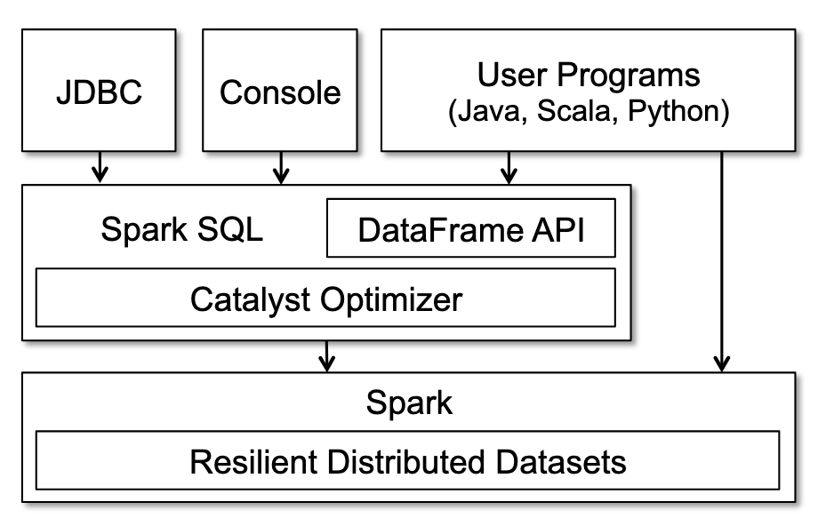

# Spark SQL

## The Problem

Systems like Pig,  Hive, Dremel and Shark all take advantage of SQL-like declarative syntax to allow for easier optimization during planning. Relational systems  aren't well suited to ML and graph processing - these are normally more  procedural. 

The procedural and relational  paradigm have been separate, forcing users to choose one. **Spark SQL** aims to combine both models to make Spark more flexible. 

## What is Spark SQL?

Spark integrates relational processing with Spark's functional programming style. 
#
> _Aside_: Relational Processing
> 
> This data is defined by its relations to other part of the data.

Spark SQL provides a DataFrame API that is able to carry out relational operations on both external and internal datastores.

It also provides an extendable optimizer to allow developers to handcraft optimizations specific to their tasks.

## Using Spark SQL

Spark SQL runs on top of Spark, it exposes SQL interface which can be accessed programatically or though  command line.

## Why use Spark SQL?

Fast Execution, it performs much better due to  its ability to be tuned and optimised using custom rules.

Spark SQL allows for real time processing meaning that new data can be pushed straight into an existing datastore,  saving  computation time.

## Real world applications

Spark SQL enable ML and other analysis on huge datasets making it great for a number of applications:

* Twitter use it for sentiment analysis, they have a tool that allows organizations to identify trending topics to create effective marketing strategies. 
* As Spark SQL is real time, it can look at high traffic data  such as credit card transactions to spot fraud.
