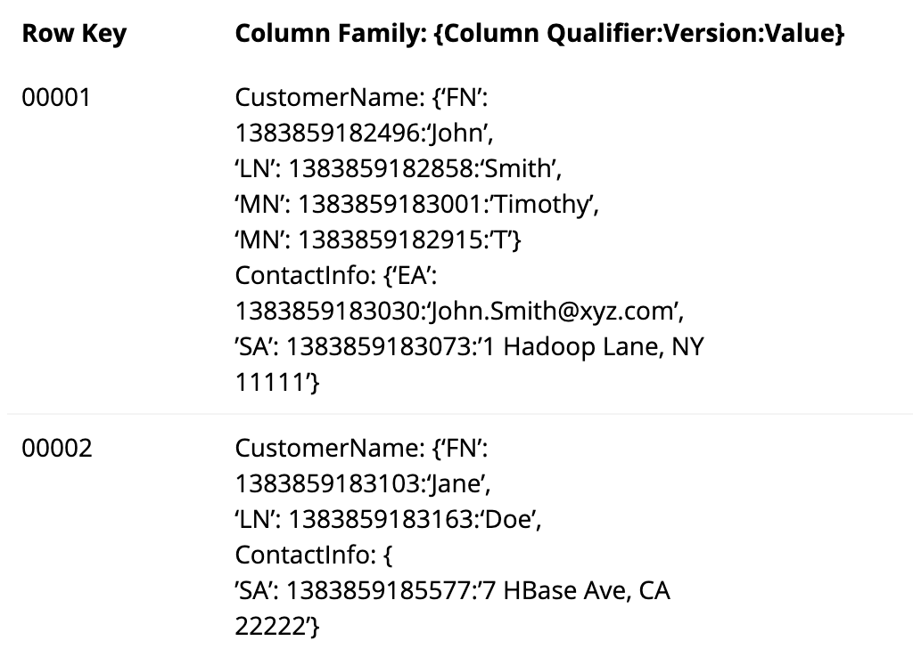
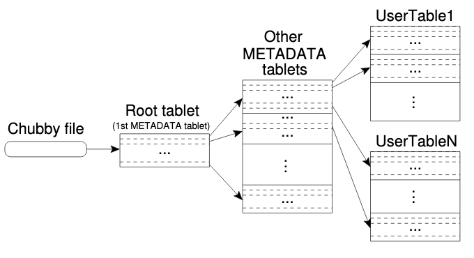

# Google BigTable

## Motivation

### Limitations of GFS

Designed for unstructured data, this means that it is designed for sequential reads, not random access. 

### Semi Structured Data
Most data uses structured data;
* Web data
* Per-User data
* Map Data

GFS is not suited to these tasks

### Why not use a DBS?

DBS are not scalable, as most systems are designed for single machine operation, meaning it cannot easily increase in power. 

## Overview

A BigTable is sparse, distributed and persistent multi dimensional sorted map. 

It allows you to insert a key and an associated value e.g. `Key(Row,Column,Time) -> key`. 

## Features of BigTable

BigTable is scalable, it can support thousands of machines with millions of read and writes per second.

It is self managing, meaning new machines can be added easily. It also manages load balancing internally. 

BigTable has seen great success in Google, it is used in web indexing, Earth, Analytics, Finance...

## Structure

A table is made up of rows, column and vales.

### Row

A row is uniquely identified using a key. They are sorted alphabetical order. All rows are atomic however they do not support transactions across rows. Transaction guarantees only apply to a single row. This design decision makes it easier for clients to reason about a table's behaviour under concurrent updates as there will never be a half completed transaction. 

A sequence of rows are known as a _tablet_. Structuring rows in tablets allows for faster access. Note: BigTable doesn't explicitly support tablets, it is a design pattern with the ID. Using tablets makes reading short ranges quicker as they are usually in a few machines rather than spread across a large number. 

Tablets can be exploited in BigTable to make analysis more efficent, for example grouping tablets by domain can help crawlers look at a set of related pages quickly. 

>_Aside_: Possible Exam Question
>
> How could you extend BigTable to allow for multiple row transactions.

>_Aside_: Database Transactions
> 
>A transaction allows multiple database changes to be bundled together and performed atomically. This also allows you to undo actions. <a href="https://www.youtube.com/watch?v=Y7ulFqYjaT4">More detail</a>

>_Aside_: Atomic Operations
> 
> An Atomic Operations is one that either completes in its entirety or not at all. This means that you cannot perform part of an operations. <a href="https://www.youtube.com/watch?v=Y7ulFqYjaT4">More detail</a>

### Columm

A column are organized by _families_.; where family is a set of related columns e.g. Personal Info family could include Name, Address, Phone. 

A column _must_ have a family! This is due to the way we key into columns. A column key is named using the syntax: `family:qualifier`. 

A use case for families is access control, e.g. if you had sensitive data in a row, you could have two column families, one is available to everyone but the other is only available to admins.

#### Column Qualifiers

A family can have a series of qualifiers, these are labels for the data you may store in the family. For example; in a Customer table under the _Name_ family, we might store 'Last Name', 'First Name' and 'Middle Name' as qualifiers. A column family can contain different numbers of qualifiers in each row. 

### Value

Each value in the table has multiple versions based on a time stamp. 

A UNIX timestamp or a custom timer is used to store "version", this allows for operations such as _last K values_. We can also _drop all values older than K_. 

## Programming API

BigTable naturally provide a CRUD (create, read, update, delete) interface for the system. 

We can also scan several rows, this provides an iterator interface to loop over. 

## Building Blocks

BigTable uses several other bits of EXC tech to manage its infrastructure. BigTable uses <a href="./google-file-system.md">GFS</a> to store log files and data. 

BigTable operates on a shared pool of machines, meaning that an external cluster management system is needed for scheduling and management. 

In Google, SSTable is used to store data. Breifly, SSTable is a sorted list of string pairs where keys aren't unique. 

### Chubby

It handles highly-available and persistent distributed lock service called Chubby. 

Chubby provides a lock service that allows its clients to synchronize their activities and have them agree on the state on the environment. 

Chubby uses a set of small servers known as replicas, a master is elected from the replicas and provides a lease every few seconds. Each replica stores a copy of the database, when a write is performed the master propagates it to replicas and confirms completion once it has reached most replicas.

For reading the client only needs talk to the master node. 

This is used to help control the database table by:
* Ensuring there is only one active master
* Store the bootstrap location of data
* Discover tablet servers
* Store Schema information
* Store access control lists 

## Implementation

BigTable consists of three major parts; a library, a master server and many tablet servers.

The library provides an interface into Chubby and subsequently BigTable

The master assigns tablets to _tablet servers_, detecting the addition and expiration of tablet servers, balancing load and garbage collection.

Each tablet server manages a large group of tablets. The handles reading and writing to its own tablets and splitting tables that have grown too large. 

Sim. to other single master distributed systems such as GFS, the data never moves through the master, the master tells the client where to find the data. 

### Tablet Location

The tablets are stored in a hierarchy similar to a B+ tree (a tree that allows for quick indexing while providing links between leafs for fast in-order traversal).

The root of the tree contains a Chubby file and a root tablet which stores the location of more fine metadata tablets. The final layer points from the fine meta data tablets to a location in the table.

This method can store 2^61 128MB tablets with a 3 layer structure. 

### Tablet Assignment

Each tablet is assigned to one tablet server at a time. The master keeps track of the current assignment of tablets to tablet servers. 

BigTablet uses Chubby to keep track of tablet servers. When a tablet server is down. We detect it through polling tablet servers for the status of their Chubby lock, it the tablet server has lost its lock or the request returned no lock, we try to reestabilish the lock. If we reacquire the lock, we know that Chubby is working but the tablet server is not. The master then moves and rebalances the tablets from the server to a different location. 

### Tablet Serving

#### Updating

The persistent state of the table is stored using GFS. When a user requests an update, the transaction actions are stored in a tablet log on GFS. The most recent commits go into memory under the _memtable_.

#### Writing

When a write operation performs the following steps happen

1. The server checks the write is well formed and that the sender has authorization to make the write. (This is done through Chubby)
2. A valid mutation is written to the commit log and the contents of the update are put into the memtable. 

#### Reading

1. The server checks it is well formed and that the sender is authorized. 
2. The SSTables files in GFS are read and the changes stated in the memtable are applied to get the current version of the table. 

### Compactions 

 If the memtable has grown too large, it is frozen a new one is create and the frozen memtable is converted into an SSTable and written to GFS. This allows the memory usage of the tablet server to be kept small; and reduces the amount of data that has to be read from the commit log during recovery.

When the number of SSTables grows beyond a bound we performs _major compaction_ where we merge all SSTables into one file. This also provides an opportunity to delete marked files in the SSTable. 

## Refinements

There were a number of refinements performed on top of the base implementation to improve performance, availability and reliability.

### Locality Groups

To improve the efficiency of reading one part of a column family, we split the columns into locality groups. These are put into seperate SSTables meaning that when a client wants to access only one column family, they can do so without having to read unneeded family. 

### Compression

By compressing locality groups, we can save space and store more tablets and reduce network traffic. However the compression used isn't the most space efficient as the designers proirtised speed over space saving. 

### Caching for Read Ops

The tablet server uses two levels of caching; the first is a scan cache that stores key-value pairs returned by the SSTable. The block cache is lower level and caches the SSTable blocks that were read by GFS. The Block cache is useful when application read data near to the previous reads. 

### Bloom Filters

As read ops need to scan all SSTables this could result in many disk accesses. We reduce this by using a Bloom Filter which tests if an element is a member of a set very efficiently. This allows use to see if an SSTable may contain data from the needed row/column
