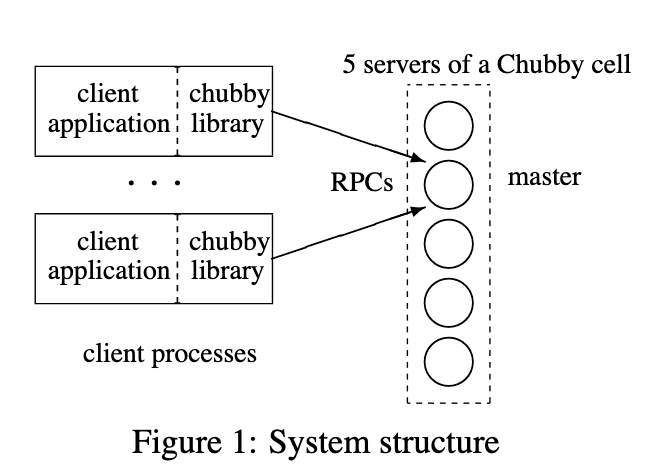

# Chubby

## Motivation

Chubby is used to manage a large group of loosely coupled distributed systems consisting of moderately large numbers of small machines. It provides a lock service, that allows its clients to synchronize their activies and agree on information about their environment. 

### Chubby in the wild

Chubby is used in GFS to appoint a master server, and in BigTable to manage access to the master node. 

## Structure

Chubby is made up of two main components; a server and a client library. 

A chubby cell contains a set of servers known as replicas, placed across racks to reduced correlated failure chance. The replicas use a distributed consensus protocol to elect a master. 

Each replica contains a simple database, but the master initiates reads and writes to the database. Non-master nodes simply copy the master. 

Read requests are satisifed by the master alone and write requests are propogated through the consensus protocol to all replicas, being acked when a majority have responded.

### Locks and Sequencers 

Each chubby file and directory can act as a reader-writer lock; either one client handle may hold the lock in exclusive (writer) mode, or any number of clients handles may hold the lock in shared (reader) mode.

An issue in distributed systems is that clients holding locks can die; or could be taking a long time to respond. Thus we don't want to immiediatly give out a new lock when we don't hear back from a client.

We can handle this using a lock-delay that specifies a timeout for each request. 

Another solution is using a sequencer. A lock holder may request a sequencer. THis is a byte string that describes the state of the lock immediately after acquisition; it contains the name of the lock , the mode in which it was acquired and the generation number. The client then passes the sequencer to th servers, if iit expects the operation to be protected. The server is tests if the sequencer is valid if not it rejects the request. The generation number changes with each release and aquisition, meaning if slow clients try to access a re-locked asset, they will be rejected. 

