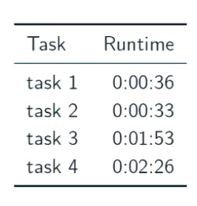

# Coursework Notes

These are notes from the EXC coursework summary. 

One assignment, 4 tasks all solvable using MapReduce paradigm

There are 3 self study labs these teach you the stuff to do the assignment.

## Grading

### Correctness (easy) 
Ff correct full marks

### Efficiency (hard); 
Much more work but will be rewarded. Not looking for the _best_ solution but looking for a good one that makes use of optimizations

#### Optimize the workers and leverage inter-worker parallelism**
Workers must have O(1) space complexity. To achieve this use data structures of bounded size. Paralleize tthe work by using many reducers instead of one if applicable. 

#### Minimize the number of rounds

Use a one-round solution unless the other effiency principles are violated. They will say they think you probably need more than 1.

#### Minimize the network traffic 
(probs using combiners)

## Data Set
Use small dataset of testing, use large for final submission.

Note working solution with small does not mean large will work. 

**MUST USE PYTHON2**
**TEST YOUR CODE BEFORE THE LAST DAY! THE CLUSTER WILL _PROBABLY_ BE vvvvvvv SLOW ON THE LAST DAY**

We have access to HDFS through DICE. 

## Resources

Questions; check piazza and tag Q using task tag. 

