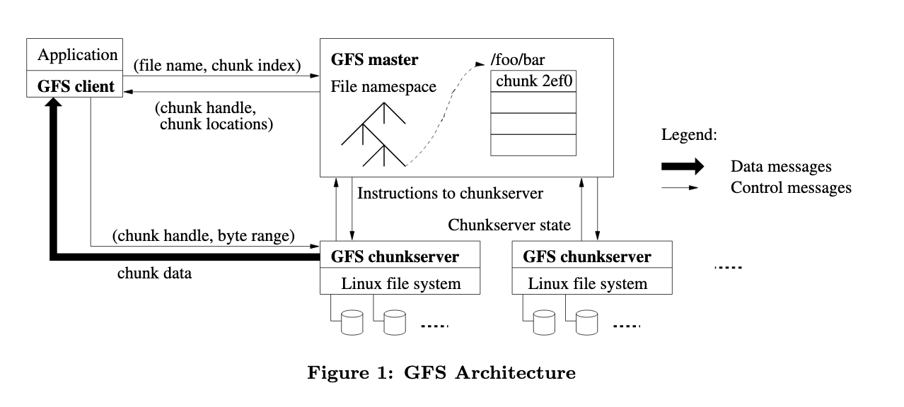

# Data Management with Google File System (GFS)

## Motivation

With huge amounts of data, reading this data from a single data source will run into bandwidth limitations. 

To solve this we should use multiple disks; this gives `no. of disks*bandwidth` capacity!

GFS was built to with the  view that component failures are the norm. If they want to operate a huge scale, they will ned 1000s of machines and to not be affected if one drops out.

GFS observed several things about other DFS systems; they had huge GB-sized files as standard, random writes were practically non existent and most files were mutated by appending new data rather than overwritiing existing data. Due to this, GFS focuses on appending data.

GFS was co-designed with the programming API making the developer experience superior to sim. DFS. 

## What is a Distributed File System? 
A DFS allows users to access and use data from multiple locations as if it were their own. It abstracts away all the complexity and provides a simple API for client interaction.

## Design Requirements
* Ability to store large files
* Scalable 
* Performant
* Write Once (append only) - we only append to memory we don't create a new block for each input.
* Available
* Namespace
* Concurrency - multiple reads at the same time = oof

## Interface

It runs on a cluster of machines, a client accesses it via a client/server model (a client might be a MapReduce job). 

GFS exposes two API, 

### Simple shell interface
* Allows for standard UNIX commands; mv, rm etc.. 
* Copy(From/To)Local copies from the client to the file system.
* Additional commands for Snapshots, Appends...

> Aside: Snapshots
> 
> We use snapshots to rollback changes, we take a snapshot of the current filesystem allowing for a development and master copies meaning changes are not destructive.
> 
> Snapshots are stored within GFS using the "copy on write" method. This initially stores just the metadata of the files however, once the original data is changed the data is stored at its current state. This saves on storage space as a snapshot may not have differences in every file. 

### Programming API
* Allows access from many languages making application development easy with GFS
* This API is not compatible with POSIX API as it only allows for appends

> Aside: _POSIX_
> 
> POSIX is a set of IEEE standards that define how programming interfaces should operate. This makes it easy to port to other POSIX systems. POSIX is one of the reasons why you can port UNIX programs across many different derivate. e.g.Linux & MacOSX.

## Architecture

We have a master node (NameNode) which stores the metadata about a set of distributed slaves (DataNode).

### Basic Functionality

When a file is added to GFS, it is split into various chunks. These chunks are divided up between Data Nodes and stored in their individual file system. For safety, a single chunk is store across multiple systems. 

Namenode stores the location of the chunks in the DFS. It periodically sends a _HeartBeat_ message to a DataNode to get its state. 

>Aside: Caching in GFS
>
>As GFS generally deals with large files that would be impractical to cache, the master node nor client caches any file data at all.
>
> The only caching that takes place is the client  that stores _metadata_  about from the master node. 

###  The Master Node

GFS uses a single master node to simplify its design. Using one master node allows for smart allocation of chunks as it has a  **global knowledge**. 

An issue with a single master is that it can be a bottleneck, therefore we must reduce the work it performs per client. 

The master uses a _HeartBeat_ request to get the state of each DataNode. When a new DataNode joins, it advertises to the Master its chunks. This means that the DataNode always has the final say on what chunks are where and reduces the complexity of having a synced master. 

#### Operation Log

The Operation log stores a record of all critical metadata changes. It serves as a logical time line for how the system has changed. It also allows for snapshots to be taken and for the master node to recover from catastrophic failure (see _Master Safety_). 

The log is replicated across many machines and only reply to a client once the log has been replicated. 

#### Namespace Management and Locking

The master node stores chunks locations in a look up table not a tree structure sim. to traditional file system. As some master operations can take a long time e.g. snapshotting; we must ensure that we do not lock up the entire filesystem while performing an operation.

To enforce this idea, GFS will lock a file when using it, when an operation is scheduled we lock all the files that will be needed, allowing concurrent operations to take place. 

#### Replica Placement

It is important to place replica across not only many computers but many server racks. However if you spread across racks, it means that a write operation will need to hop between racks which will occupy bandwidth. 

#### Replica Creation

##### Creation

When creating a chunk it considers three factors:

* The amount of disk utilization
* The number of recent creations on a disk
* The rack location w.r.t. the other replica

##### Re-replication

The master re-replicates as soon as the number of replicas falls below a threshold. This could be for a number of reasons:

* A disk fails
* A disk is corrupted
* The threshold is increased

##### Rebalance

Examines the current replicas and see if they are still optimally distributed. 

#### Master Safety

The master can be a point of fault if implemented incorrectly, if the master dies the metadata could also be lost. 

To combat this, we replicate the data into a disk. We also normally use multiple NameNodes in case we have a catastrophic failure. One issue with this is that the others can be lagging behind due to the nodes being updated async meaning that when the switch occurs, we cannot guarantee that the data on the new master will be up to date. 

This was fixed later with the inclusion of State Machine Replication

> Possible Exam Question: "How can we improve the master's reliability?"  

### Chunk Size

The chunk size of 64MB allows for several advantages:it reduces work load on master as client can request large chunks with few calls, this allows for the client to cache the location of a large TB working set easily. 

Another benefit of large chunks is we can reduce the network overhead by having the client do one bulk access rather than lots of small ones. It also reduce the volume of metadata stored by the client. 

A _disadvantage_ of this is that a small file can become an access "hot spot" if many clients try and access the same file, if it were in smaller chunks this load would be spread across the system. This issue was mitigated by spreading the files across more DataNodes. 

### Guarantees 

There are two different terms we use to define the state of a chunk;

**Consistent**: all clients see the same data, regardless of location

**Defined**: the client can see the changes applied to the file in their entirety.

## Operations in GFS
### Read Operation

1. A client asks for a file through sending metadata of the desired chunk
2. The master node replies with the location of the node in the DFS.
3. The client pulls the file directly from the data node. 

This splits the operation into two paths, the control path (1 & 2) and the data path (3). 

### Write Operation 

1. The client asks the master for the location of the requested chunk
2. The master replies with the primary id and all the other replicas with that chunk
3. The client pushes the data linearly through all replicas
4. The client asks the primary to perform mutations
5. The primary node serializes the mutations and sends them to the secondary nodes
6. The secondary nodes reply with their completion.
7. The client process is notified of the completion

### Data Flow 

GFS decouples the flow of data from control flow. Data flow is handled linearly, this means that we can make use of the computers full bandwidth to transfer the data. 

To move linearly effectively, we hop to the closest machine in terms of network topology. 

We also use TCP piplelining (start transfering out when we receieve) to minimise latency.

### Appending

As discussed in _motivation_, we have an append method. The append method works similar to the write method however the memory offset is decided by GFS not the user. 

When appending, GFS check that the new data will fit on the chunk; if it will then it inserts the data. If not it will pad the end, fail the operation and create a new chunk for the data.

A result of this is that a replica may not match bytewise, however will have the same data within it. 

## Garbage Collection

After a file is deleted, GFS does not immediately get back the storage space. It only occurs occasionally when a _garbage collection_ round is done. 

The garbage collector looks at the operation log to see a deletion that has not been cleaned up. If a file has been deleted for a set length of time during the heartbeat inspection, it is removed. 

An issue with this method is that apps that need to create temp files might fill up a smaller DFS leaving no space for permanent files. 

## Stale Replica Detection

Chunk Replicas may become stale if a chunk server fails and misses mutation to the chunk while it is down. For each chunk, the master maintains a version number. 

> _Aside_: Exam Questions
>
> It was noted that in the exam, GFS questions will often be about extensions to the system; e.g. how can you extend the replication protocol to ensure replication across data centres.

## Faults

### Crash Faults

Occurs when the machines fails, this causes a _fail-stop_. This is easy to design around as detecting these faults are easy. GFS uses a heart beat for this.

### Byzantine Faults

Arbitrary State Corruption; failure due to an internal failure. For example; bit flipping due to radiation. 

GFS combats these using traditional checksums. 
