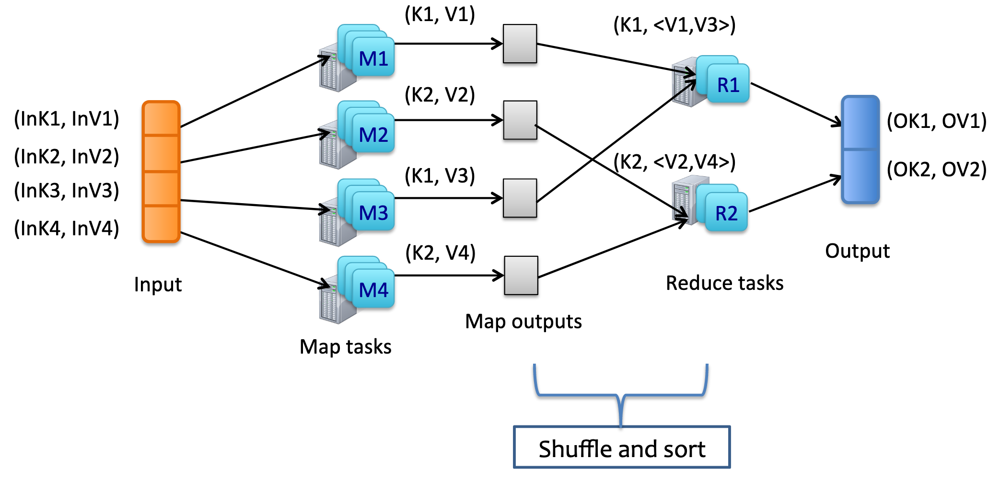

# Extreme Computing

## Intro: What is Extreme Computing

The world is full of "big data" systems; for example
* Google's PageRank
* eBay Auction Search
* Tinder Matching

Most big data applications follow the same structure: 

1. Collect (web crawl)
2. Process (PageRank)
3. Provide (Search)

The domain of Extreme Computing looks at the design, implementation and architecture behind creating systems that deal with huge amounts of data. There are three main subsections: 
* Analytics - how can we process this data
* Data Management - how can we store this data 
* Resource Management - how we manage the devices that store the data

There are two "roles" within a big data application (BDS): 

* Application programmer: specializes in how to solve the problem using existing systems. 
* System Architect: specializes in how to build a new system for a big data problem

> *Aside: How _Big_ is Big Data?* 
> 
> In 2012, Google reportedly handled 20PB (~26,000,000 GB) of data a day. This amount of data is clearly infeasible to deal with on a single machine!

## Data Centers

Data Center (DC): A huge (>100000) cluster of machines.

Data centers are generally spread across the world; this reduces delay when serving traffic from the other side of the world. E.g. Someone in Japan accessing a service hosted in the US will have to wait longer than if they access a service hosted in SE Asia. 

Advantages of a Distributed DC:
* Fault tolerant; if a data center in one locale goes down, you can divert traffic to another locale; minimising lost service. 
* Decreases latency for global users
* Allows services to scale with demand locally

## Designing Big Data Applications
There are many design challenges that need to be considered when creating a big data application:

* Parallelization
* Communication
* Synchronization
* Load Balancing
* Handling Faults
* Scheduling

For a new service we potentially have to redesign all of these from scratch. This is a huge time sink and the motivation behind _MapReduce_

# MapReduce

MapReduce is an abstracted library that provides scaffolding for creating big data services "quickly". It was created by Google as a reaction to the hundreds of special purpose big data processing systems that had been created; many of which were fairly straightforward and had designs that could be sumemmerized using two functions: _Map_ and _Reduce_.

MapReduce allows for users without knowledge of parallel and distributed systems to easily uitlize the resources of such systems.

## MapReduce Design
### Map
This function takes an input and processes in some way, e.g. multiplication or addition. It then returns a key value pair for use in the reduce function.

```
  Map(key, value) -> (key, value)
```

### Reduce
This function takes an input of a key with a collection of values and returns a single key value pair. Typically just zero or one inputs are reeturned per Reduce invocation. 

```
Reduce(key, <value>) -> (key, value)
```

> Aside: Why Map and Reduce? 
> 
> Map and reduce are inherited from functional programming langauges such as Lisp and Haskell. These were chosen as they are easy to parallise and are very tolerant to re-execution; allowing for greater reliablity. 

## MapReduce's Underlying Model


A map reduce function starts with a series of key value pairs (InKx,  Vx) store across serveal machines. We then perform a _Map Task_ on the data on each machine and outputting the resulting pair. 

We then combine the output of these into a series of key values with iterators attached via the "Shuffle and  sort" step. These are run through our reduction function and combined into a single output.

### Basic MapReduce  Example  - "Word Count"


The goal of this service is count the occurances  of each word in a  corpus of documents. 

```
Input:
(D1,"the"), (D2,"for"),(D3,"the"),(D4,"for")
```
Our _map_ function must take a document and return a key value pair of words and numbers. 
```
map(string key, string value)
  for each word w in value
    EmitIntermediate(w,1)
```
Each document outputs their own key and value: e.g. `D1 => ("the",1)`

This is then passed to our "shuffle and sort" algorithm and conbined into a series of keys and vectors. `("the",<1,1>), ("for",<1,1>)`

We then use a reduction function, we want to count the occurances so we sum the iterator.
```
reduce(key string, iterator values)
  int results = 0
  for each v in values
    results += v
  Emit(key, result)
```
Our reduction funtion returns the a single key and pair value for each (key, iterator) pair. `("the",2),("for",2)`.

### MapReduce Examples

Many interesting programs can be expressed using MapReduce:

#### Distributed Grep
We can use a map function that emits a line matching a  reg-ex. Our reduction function is just an identity function that returns the line.

#### Reverse Web Link Graph
Defining a map function that emits `<target,source>` for each webpage allows us to use a reduction function to combine these sources into a list for a target. 

#### Distributed Sort

*** update from MapReduce ***

## Implementing MapReduce

There are many ways to implement a MapReduce enviroment, thsi is an example from Google:

### Hardware

* Machines use dualcore processors with around 2-4GB of memory
* Intermachine communiocation uses either 100Mb/s or 1Gb/s links however these are often saturated
* Clusters are formed of hunderds of machines
* Each machine has a local disk, however these are combined into a distributed file system *** link when covered *** 
* A "master" machine schedules and distributes jobs

### Execution

To reduce load on a single machine, MapReduce divides up the map tasks across _M_ splits. Reduce invoations are split into R paritions based on a function e.g.  `hash(key) mod R => parition`.

#### Walk through


1. The  input data is split  by the user program into M input files around 16-64MB per piece. It then spins up a series of machines ready  to process the request.

2. One of the worker machines is assigned as the _master_, the master is responsible for deligating M map and R reduce tasks to  idle machines.

3. A map worker reads a split, parses it into (key,value) pairs which it then processes in a Map function. The output is buffered in memory.

4. Occasionally, buffered pairs are stored on the local disk and locations passed to the master for reduction workers. 

5. When a reduce worker is takes the intermediate keys and combines them by key into iteratble. If the data is too large for memory then another  sort is used (perhaps a  MapReduced one!)

6.  Once all input has been mapped,  reduction can start. The reducer workers output the (key,value) pair into the final file.

7.  Upon completion, the master wakes the user program and passes the output file back.

> Aside: Master Data Structures
>  
> The master must store the status of each task that needs to be completed. These can be represented by _idle_, _in  progress_, _completed_ and a task ID. The master also needs to be able to store the sizes and locations of the  R partitions.

###  Fault Tolerance

As MapReduce is working with  hundreds of machines and gigabits of data, failure is likely. 

#### Worker Failure

If a worker fails, its task is set to idle and the machine restarted. The output of the partially complete task is discarded. 

####  Master Failure

The master regularly writes checkpoints to a external source. This means that on failure, a clone of a previous state can be loaded. 

#### Atomic States


* When a map completes that has already finished, we throw away the result

* When a reduce finishes, it writes to the output file with a rename call, this is an inheriently atomic call; meaning that only one reduction task can write at a time.

#### Non-Deterministic Map and Reduce Functions

Most map and reduce operators are deeterministic, this  means that it is easy to visualise and step through how a program  will execute. 

However, with non deterministic functions - reduction functions can behave differently due to the output of the map function being different.

###  Passing Values Effectivly

Network  bandwidth is exteremly saturated during a MapReduce function. To save our data, we can use GFS *** link when covered ***. GFS divides files into blocks, which are then scheduled to be sent, if sending to the exact location on a target machines disk is not possible, we dump it near the end machine to reduce future network  strain.

### What size can M and R be? 

We want M and R to be larger than our number of workers, this helps with  dynamic load balancing and recovering from failure. 

However there  are limits on the size of M and R. As the master machine must make _O(R + M)_, we also must store O(MR) 

We want R also to be small enough to be managable at the output since each R partition is a seperate file. 

### Dealing with Slow Machines

An issue with MapReduce is that if a machine is taking a long time to finish, the whole process slows. To stop this, we  schedule back up tasks to run when we are close to completion of the entire program to  hopefully step in if the current task fails.

## Improving  MapReduce

### Paritioning Function

We can change our R parition function to change how our output is put together. For example if we have a set of webpages, we can parition by authoritative domain (google.com, yahoo.com)

### Ordering Guarantees

It is benefitcal to guarentee that our paritions are sorted in a set order.  

###  Combiner Function

As sometimes the map function will output a large number ofkey values,  e.g.  a document may contain hundreds of "the" words. We can do mini-reductions  before sending over the network to reduce load. 

### Skipping Bad Records

If we have a stupid  big amount of data,  fixing  the errors might not be feasible, so we just drop them and report to the  master that a record failed.  This record is included in the re-execution to avoid it. 

### Status Information

The master can run a HTTP server and serve a UI for human inspection  of the task.

### Counters

We can run counters in our map  function to return more inforation about our data. For example, couting the number of uppercase letters in _all_ documents.

## Performance

Most MapReduce programs form a sloped graph when the instantaneous input volume that is being processed. This is due to more machines getting assigned the task over time (slope up), and the nondeterministic time to completetion of each (slope down)


