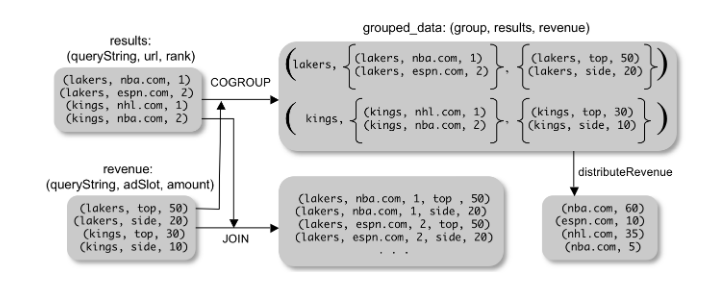
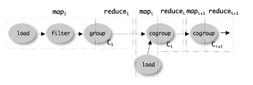

### Distributed Query Processing with Pig

## What is Pig?

Pig is a high level querying language that is designed for quick ad-hoc query processing. It aims to sit between SQLs strict declarative style and MapReduce's low level rigid form to create a better developer experience when querying large datasets.

## Why use Pig over MapReduce?

MapReduce only allows for one input source and two functions, this means that common operations such as joining need complex code. This reduces maintainability and reusability. Pig includes a number of parallised common functions to make code more readable and reusable. Pig's use of a sequential style, means that the flow of operations can easily be followed.

## SQL vs Pig Example

Pig can be used to replace SQL queries. This example shows a query to get the average pagerank of highly linked pages.

### SQL
```SQL
SELECT category AVG(pagerank)
FROM urls WHERE pagerank > 0.2
GROUP BY category HAVING COUNT(*) > 1000
```

### PIG
```SQL
urls = FILTER urls BY pagerank > 0.2
groups = GROUP urls BY category
big_group = FILTER groups BY COUNT(urls) > 1000
output = FOREACH big_groups GENERATE category, AVG(urls.pagerank)
```
It is easy to see from the above example that Pig is much more expressive in its operations. This helps developers think about the data flow in their query rather than worrying about the SQL "blackbox".

## Optimising Pig Queries
As Pig is much more transparent, it makes optimising queries easier: take this for example where we are filtering spam urls, with the intensive, user defined  isSpam method
```SQL
spam_urls = FILTER urls BY isSpam(url)
culprit_urls = FILTER spam_urls BY pagerank > 0.6
```
This query is not optimal, as we are running isSpam on all URLS, this is not efficent. We can swap the first and second lines to only run isSpam on a subset of URLs rather than the whole data structure.
```SQL
highrank_urls = FILTER urls BY pagerank > 0.6
culprit_urls = FILTER highrank_urls BY isSpam(highrank_urls)
```
## Pig Data Structure

Pig uses a non-traditional structure of tuples to represent its data. This is because it does not need many of the features that come with a complex structure:
1. Transactional Consistancy Guarentees
2. Efficient Lookup
3. Curating data for future users
As Pig supports read-only operations, 1 & 2 are not needed as these become useful when writing to a datastore. 3. is generally not needed for Pig queries as it is designed for quick queries on temporary data. Thus a defined schema is not necessary.

### Nested Data Model

Pig uses a nested data model to store data; this has a number of benefits however it does violate the 1NF rule.
> Aside: First Normal Form (1NF)
>
> 1NF is a principle that says a data entry should only have 1 value associated with it, e.g. `name: Freddie` is 1NF, but `name: [Freddie, John]` is not allowed. This helps remove redundancy in the data (all fields have one purpose that is not carried out by another) and consistency

This structure brings the advantages:
* A nested data model is similar to how a developer often works with data, Maps etc. rather than flat structures
* Data is usually nested by nature, e.g. a webcrawler naturally returns `url: Set<url>`
* It allows for a simpler sequential experience, GROUP can output a map of labels to values, e.g.

```
{
    "Desktop":[
      "0":"a",
      "1":"b",
      "2":"c"
    ],
    "Mobile":[
      "5":"g",
      "7":"h",
      "8":"i"
    ]  
}
```
* Easily accommodates user defined functions

Pig has 4 data types in its structure;
* Atom: a single value; `"Mobile"`, `0`, `true`
* Tuple: a sequence of fields of any type; `("John","Smith",40)`
* Bag: a collection of tuples with potential duplicates; `{("John","Smith",40),("Sarah","Bloggs",24),("John","Smith",40)}`
* Map: a traditional map of atoms to bags;
```
{
  "Mobile":{("John","Smith",40),("Sarah","Bloggs",24),("John","Smith",40)}
  "Desktop":{("Sarah","Smith",75),("Joe","Bloggs",24),("Alex","Smith",25)}
}
```

## User Defined Functions (UDFs)

UDFs are treated as first-class citizens in Pig, they have a number of provided functions that can help build complex repeatable behaviours.

### Parallelism

Pig has a very small set of primitives that a parallelism for common operations such as FILTER and FOREACH, however using functions outside the provided methods can lead to unparalleled functions which significantly reduces performance.

## Syntax

### LOAD
Specifies input to load into the query
```
query_data =  LOAD data.text
              USING myLoad() // custom deserializer
              AS (userID, queryString, timestamp)
```

Returns a _bag handle_, this doesn't actually read in the data, just specifies _how_ to read the data when needed.

### FOREACH

Loop over all tuples and apply a function
```
extended_query = FOREACH query_data GENERATE userId, expandQuery(queryString)
```
Here we loop over each tuple in the `query_data` bag and generate a new tuple of the form `(x.userId, extendedQuery(x.queryString))` and puts them in a new bag `extended_query`

### FLATTEN
Take a map and turn it into a bag of data, `a: {(b),(c)} -> {(a,b),(a,c)}`
```
extended_query =  FOREACH query_data
                  GENERATE userId, FLATTEN(expandQuery(queryString))
```
### FILTER
Returns a bag of tuples that satisfy an expression;
```
real_queries = FILTER queries BY userID neq 'bot'
```
Note: this could also be expressed using a UDF;
```
real_queries = FILTER queries BY isBot(userId)
```
### COGROUP
Creates a map of bags out of two or more bags keyed by a common field.
```
grouped_data = COGROUP  results BY queryString
                        revenue BY queryString
```
This differs from JOIN as it generates a map rather than a bag of tuples. JOIN can be performed by taking the crossproduct of a COGROUP-ed data set. In SQL, the same effect would be achieved by JOINing on `queryString` and then GROUPing by it.


### GROUP
When only one dataset is involved, we can use GROUP to achieve the same effect:
```
grouped_revenue = GROUP revenue BY queryString
```

### JOIN
JOIN provides a syntactic shortcut for COGROUPing followed by FLATTEN.
```
join_result = JOIN results BY queryString,
              revenue BY queryString
```
### Map-Reduce in Pig Latin

We can easily implement a similar behaviour to map-reduce using FOREACH and GROUP.
```
map_result = FOREACH input GENERATE FLATTEN(map(*)) // Map
key_groups = GROUP map_result BY $0 // Shuffle and sort
output = FOREACH key_groups GENERATE reduce(*) // Reduce
```
### STORE
Store specoifies the result of an expression to be put into a file
```
STORE query_result INTO 'myoutput'
      USING myStore()
```
myStore is a custom serializer

## Implementation

Yahoo! use Hadoop as a platform for the carrying out the queries. Pig jobs are converted to a series of map-reduce jobs.

### Planning

Pig must build a logical plan as to how to carry out a query. It does this by working top down from the first bags. it checks that if bag `a` and `b` are referenced, that they are defined earlier in the expression. When a new bag `c` is declared with relation to an existing bag, the plan for existing bag is put in place of the reference. This is so it is clear of the order of CO(GROUP) and to inform what should take place in the map stage of each CO(GROUP).

No processing happens until the planner hits a STORE command, at which point the logical plan is complied. This means that we can optimize our logical plan further before we run the query.

### Compilation into MapReduce

MapReduce steps are produced from the logical plan created in the previous step. There are several steps involved in this stage.

All CO(GROUP)s are split into distinct map-reduce jobs with their own functions. All LOAD, FILTER and FOREACH step are pushed onto a map function corresponding to the CO(GROUP) step.   

The reduce step for each CO(GROUP) completes the operation and passes the data as the input for the next operation.



> _Aside_: Ensuring Parallelism
>
> We inherit parallelism for LOAD due to Hadoop use of a distributed file system.
>
> For FILTER and FOREACH, we inherit these from the execution of the map function during a MapReduce Job
>
> CO(GROUP) paralellism is achieved through reduce's partioning during MapReduce

## Applications of Pig

### Rollup Aggregates

Computing statistics for user activity from logs, web crawls and other data sets can be done easily  with Pig. Pig is more suited to this than raw MapReduce as you simply see the calculations taking place step by step rather than trying to develop your own  all-in-one  function.  

### Temporal Analysis

Changing data  over time. We can use Pig to analyse distribitions. COGROUP is good for thsi as we can get a set of search queries from across many logs and collate them into one structure quickly. We can then use UDFs to create repeatable functions for each of them. 
