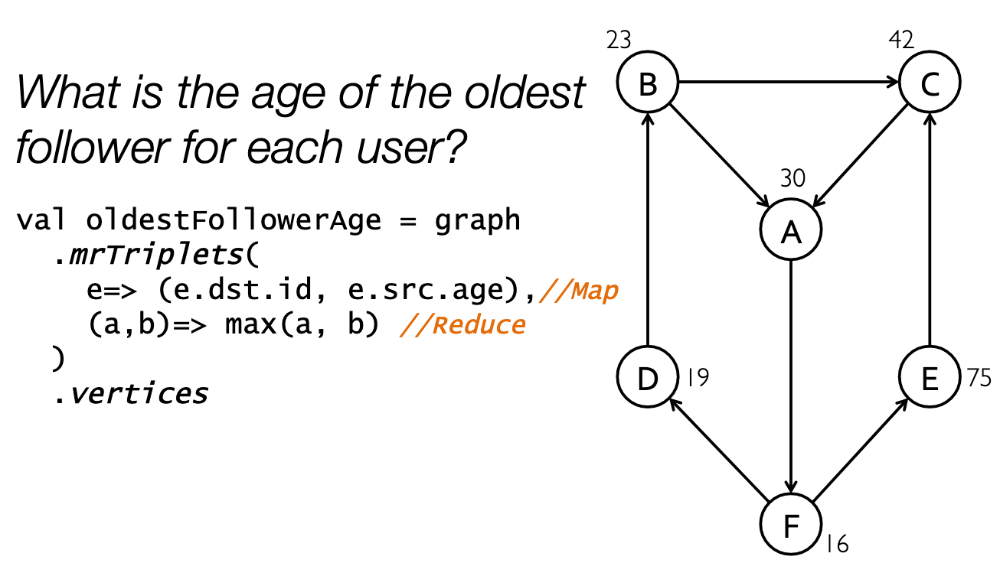

# Pregel

## Motivation

Graphs are commonly used in web search, navigation and social networking.

### Why not use Pig/MapReduce? 

MapReduce is very inefficient; as it does not take into account relationships between rows by default; this means that the developer has to do more work each time. It is also costly to replicate the data.

MapReduces after each stage writes the output to disk. This means that there is a cost of running each iteration. 

## Overview

Pregel uses a similar structure to MapReduce by abstracting away the complexity and providing the user an API. 

Once a Pregel query is complete it outputs a set of values from the verticies. 

Pregel uses a bulk synchronous parallel programming model. 

### Execution

There are two steps that iterate until some stop condition;

1. **Compute**: this step involves each vertex on the graph performing its own computation and updating it. 
2. **Communicate**: this step involves each vertex communicating with its neighbors and then each node processing the data from each vertex. The vertex then hits a barrier that waits until all vertices are ready to move to the next iteration. 

Each run of this is known as a superstep.

This barrier provides synchronicity and prevents deadlocks making the library more reliable. 

#### Distributed Execution

Sim. to MapReduce, Pregel can run across a set of machines, verticies are partitioned by hashing or a user defined.

#### Message Passing

Rather than doing remote reads, Pregel opts for a pure message passing model. It was found that this was expressive enough for most graphs. Pure message passing also imprves performance. In a cluster enviroment, reading remotely takes up valuable network traffic, by using message passing, we can slowly reduce the latency by delivering messages of decreasing size (due to the halt vote) and delivering messages in batches.

## API

Pregel uses a "vertex centric" API

All vertices start in the active state; at the end of each round, a vertex will vote to continue or halt. If they halt then they do not participate in the next super-step. The algorithm terminates when all vertices have voted to halt. A vertex can receive a message and become active again.  

### Additional Features

**Combiners**: Sim to MapReduce, on one machine you have N nodes running in parallel, we can do a local communicate step in memory first.

**Aggregators**: Pregel provides a method of providing a value that can be passed into a reducer and made available to all vertices in the next iteration. This allows Pregel to perform sum and global statistics. 

**Mutations**: We can remove and add vertices and edges during the execution.

**I/O**: is compatible with GFS, BigTable etc.


## Implementation 

Pregel runs in a distributed system across many worker nodes commanded by a master. 

The master is elected and is responsible for coordination and passing messages between nodes. It also determiens how many parititions the graph will have and assigns them to other workers. 

A worker maintains the state of its portion in memory. It also stores its current active value, whether it will be active in the next step and two imcoming message queue. We need two queues as we will be processing one from the previous step and having to recieve messages from the current step concurrently.

### Fault Tolerance

The master instructs each worker to save the current state at each super step. This means that if a worker dies, we can restart from the last checkpoint. 

Failures  are detected using regular ping messages. 

It also uses confined recovery; the workers log outgoing messages from their assigned partitions during graph loading and supersteps. This means that we only need to recover the lost partitions and replay the messages rather than reseting the entire system. Note this does require a deterministic algorithm as the messages should produce the same result when replayed for this method to be effective. 

## Applications 

### PageRank 

PageRank involves finding the weighted sum of incoming links to a node. As we iterate, neighbours update their pageranks their neighbors.

As PageRank needs to operate on a large network, we iterate 30 times and then stop. At each step we calculate the sum of the neighbors ranks, and then pass it out to all neighbors.

```cpp
class PageRankVertex 
  : public Vertex<double, void, double> {
      public:
        virtual void Compute(MessageIterator* msgs) {
            if (superstep() >= 1) {
                double sum = 0;
                for (; !msgs->Done(); msgs->Next())
                  sum += msgs->Value();
              *MutableValue() =0.15 / NumVertices() + 0.85 * sum;
            }
            if (superstep() < 30) {
              const int64 n = GetOutEdgeIterator().size();SendMessageToAllNeighbors(GetValue() / n);
            } else {
              VoteToHalt();
            }
          }
        };
```

## Other Systems

### GraphX 

GraphX enables users to not ony process graph like data, but include unstructured and tabular data and allows for the data to be viewed both as a graph and collections _without_ any data movement or duplication. 

GraphX does this by expressing graphs as a collection. Each vertex contains a value and is identified by a _vertex identifier_. We also have an edge collection which contains the edge properties keyed by source and destination. By reducing this to a key,value system we can easily incorporate non-graphlike data; for example if we were tto add a vertex, we can represent this as a JOIN operation to the vertex collection. We can construct a graph from these collections.

We can also do map reduce operations  through this method using a MapReduceTriplet, this datastructure represents the connection between two nodes. For example;



The `mrTriplets` operator produces a collectiton containing the sum of the inbound messages keyed by the destination ID. 

