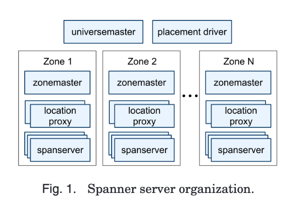
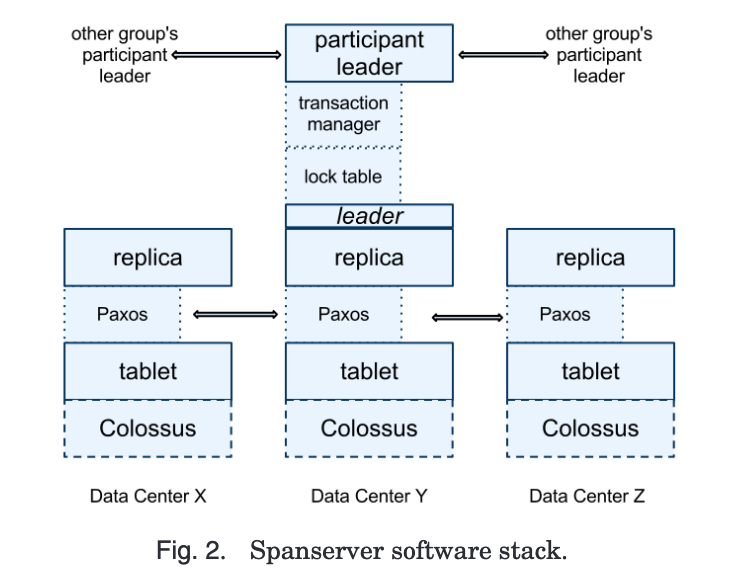

# Spanner: Google's Globally Distributed Database

_This is kinda NE, it may help answer questions on the short comings of BigTable_

Spanner is a scalable, globally distributed database designed, built and deployed at Google. It shards data across amny sets of Paxos state machines data centers across the world.

Spanner automatically reshards data across machines as the amount of data or the number of servers changes, and it automatically migrates data across machines and datacentres tto balance load and in response to failures. 

> Aside: Paxos
> 
> A family of protocols for solving consensus in a network of unreliable processors.

## Issues with BigTable

* It is bad for complex, evolving schemas
* It does not have strong consisttency across data across wide-area replication

## Implementation

Spanner is organized into a set of zones, where each zone is the rough analog of a deployment of Bigtable servers. A zone is also a location where data can be replicated too. Importantly zones are a unit of physical isolation, they can exist in the same data centre but must be partitioned across different sets of servers.

A zone has one zonemaster and between 100-1000 spanservers. A location proxy tells clients where to find their data. 

The Universe master serves as a debugging platform and provides status information, the placement driver handles automated movement of data across zones. 

### Spanservers

Each spanserver is responsible for a tablet, this is similar to BigTable in that it implements a bag of the mappings:

`(key, timestamp) -> string`

Unlike BigTable, Spanner assigns timestamps to data rather than version number. 

To support replication, each spanserver implements a single Paxos state machine on top of each tablet. Each state machine sstores its metadata and log in its tablet. 