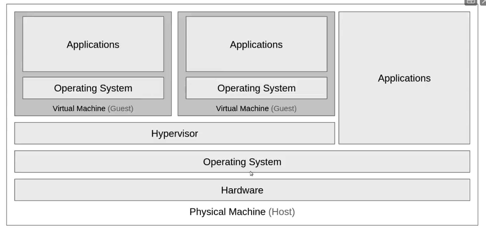
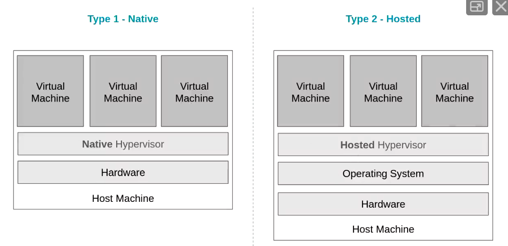
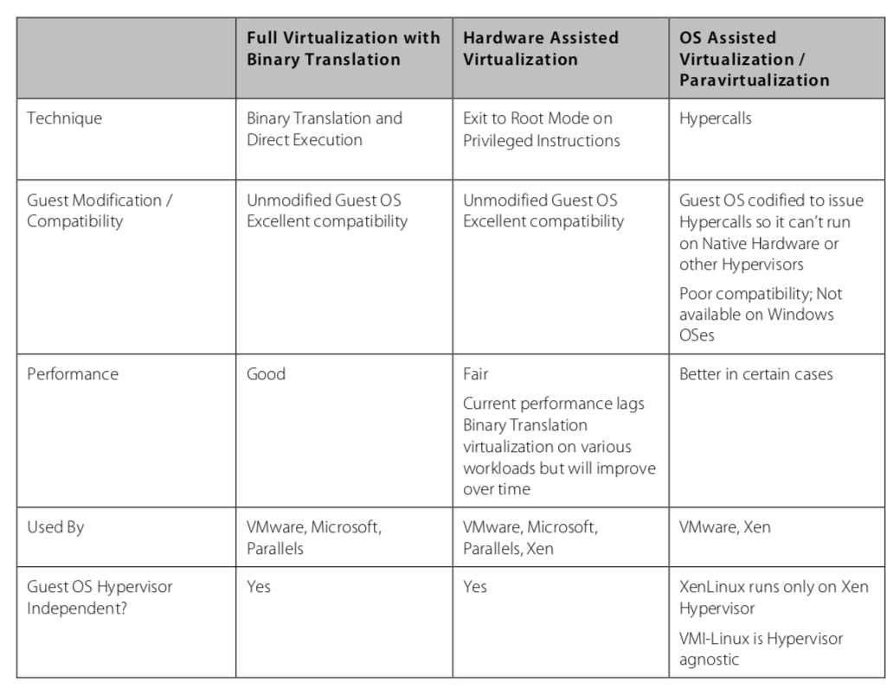

# Virtualisation

## Motivation

As many clients want to run on different operating systems, having dedicated machines will not scale to meet demand. If a node crashes, we must wait for the node to restart before meeting availablity again. 

To solve this we run several VMs on each node. This allows for reliablity as we can run OS across racks and nodes increasing fault tolerance. If a node drops off we can move the client programs to another node and spin up another VM

We can also scale up and down the number of nodes running an OS. THis allows for server consolidation (making efficient use of the racks).

## Overview

Virtualisation is the process of creating a virtual version of a physical object. We can virtualise hardware by creating a virtual version of real hardware. 

### Jargon

* **Virtual Machine**: a virtval representation of a physical machine
* **Virtual Machine Monitor/Hypervisor**: A software application that monitors and manages running virutal machines
* **Host Machine**: The physical machine that a virtual machine is running on
* **Guest Machine**: The virtual machine running on the host machine

## Architecture

A typical VM node is shown below

### Hypervisors/Virtual Machine Monitor (VMM)

The VMM is in charge of running the virtual machines. A VMM allows for the application to be installed on a fresh OS rather than piggybacking on the host OS. 

There are two main types of VMM

**Type 1: Native** run directly on the host machine, and share resources between other guest machines

**Type 2: Hosted** run as an application inside an OS and support VMs as independent processes (VirtualBox)

### Popek and Goldberg Requirements for Virtualisation

A VM must have three main properties:
1. **Efficiency**: the majority of guest instructions  are executed directly on the host machine
2. **Resource Control**: the VMM must remain in controls of all machine resources
3. **Equivalence**: the VM must behave in a way that is indistinguishable from if it was running as a physical machine 

### Trap and Emulate

How can we make sure a virtualized OS does not interact with another guest on the same host? When a VM makes a privileged instruction it is caught by the VMM and emulated in the application level. This means that the guest never reaches the true kernel level. 

#### Issues with Emulating x86 Hardware

X86 based OS are designed to run on bare-metal hardware, meaning unlike other systems, x86 assumes that it has full control of the computer hardware. To ensure equivilence in the VM we must provide a way to emluate a kernal that is indistingusable to x86. Trap and emulate kernal virtualisation doesn't work effectivly for x86 as some commands behave differently when they aren't executed at the kernal level. 

#### Binary Translation

With this approach, the VMM will translate non-trappable kernal commands into the equivilent commands to run on the host OS. User applications are decoupled and are allowed to run directly on the host system. 

Full virtualisation means that the guest OS is completely decoupled from the host hardware; this enforces _equivilence_, as the guest OS is nto aware it is being virtualised.

Full virtualisation provides the best isolation and security for VMs and is a more portable solution as the guest OS does not need to be modified to run on real hardware.

## Paravirtualisation 

During PV, the Guest is aware they are being virtualised. They co-operate with the VMM to enable increased memory performance. They don't use the slow trap-and-emulate system, rather directly call the HMM for privileged instructions.

The advantage of this over fully virtualisation is the lower overhead, however this greatly depends on the function. It is also relatiliy easy to get a paravirtualised VM running compared to a fully virutalised one. 

AS paravirtualisation requires significant modification to the guest OS, this can lead to support and maintainability issues in production. 

### Hardware Acceleration

Modern processors include hardware support from VMs; this allows guest instructions to run safely on the natively on the processor.

This is achieved by providing a level below Ring 0, that thte VMM runs on. This can automatically trap priviged and sensitive commands without the need for binary translation or paravirtualisaion. 

## Use Cases

* **Personal use**: users can run multiple OS on one host without having to reboot all the time!
* **Technical use**: building new OS is tricky and harder to debug especially when developing hardware
* **Commercial**: allows for servers to be OS agnostic; providing better load balancing ability

## Types of Virtualization

### Software Emulation

When emulating software that does not run on the native OS such as an NES game, we translate our instructions from the native assembly language to the native code; these can then update data structures as if the required OS was running. 

These have a very high overhead as each instruction must be translated. 

QEMU provides software emulation services, it emulates hardware by creating binaries of high cost/frequently run areas. It also allows for cross-architecture virtualization as it translates the instructions into the native OS. 

### Hardware Virtualization

The code is run on the native CPU this allows for native speed, however this constraint means that  it can only emulate OS that run on the same architecture.  KVM provides a driver to turn your kernal into a VMM; this allows for VMs to run using the physical CPU. 

## Memory Virtualisation

As well as computation, a VM needs to access the host's memory and share address space with othere guests on the system. This is implemented by translating contiguous address space to a disconnected one in the host; the VMM provides a mapping between these address spaces. 

## KVM

Kernal Virtual Machine (KVM) provides Linux with the tools to act as a type 1 hypervisor running an unmodifieed guest OS inside a Linux process. KVM makes use fo hardware accleeration features which removes the need to translate instructions.

KVM provides several handy features, such as live migration that allows physical serevers to be evaucated for maintaince without distrupting the guest OS. 

As a guest in KVM is a process, it can be descheduled and have virtual RAM removed with out notification causing performance dips that are tough to trace.