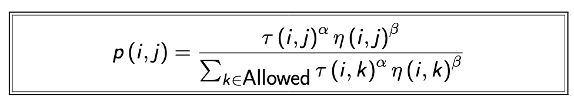
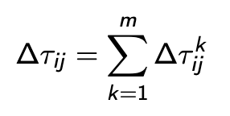
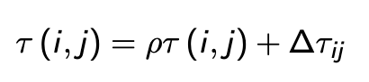
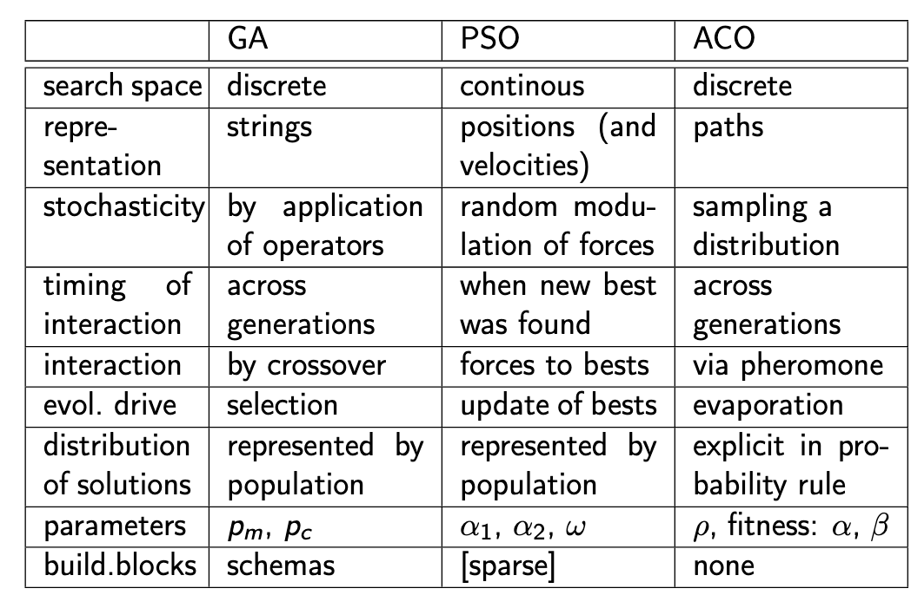

# Unit 5 - Ant Colony Optimization

ACO aims to emulate the behaviour of pheramones in ant colonies. The more often an ant travels a path to a point, the higher the probability later ants will follow. 

Another important note is that we decay the trail over time to help the ants forget suboptimals olutions

## Artifical Ants

In ACO Pheromones cannot be ethe only source of information. Their distribution will need to depend on another heuristic, for this reason ACO has not been very successful in the real world. 

### Example: Travelling Salesman

* Each ant builds its own route
* Each ant chooses a town to go to with a probability that is a function of; the town's distance and the amount pheromone on the connection. 

This yields a network of nodes connected with the probabilities that an ant should follow it attached. We use this to derive our solution.

## Probability Rule

ACO uses a compound probability of the pheromone and random chance to explore and exploit regions. 

The strength of the pheromone `τ(i,j)` is the likelihood of j following i in our step. 

The visibility `η(i,j) = 1/d(i,j)` is a heuristic that guides the construction of a route. This can change depending on the problem, here it is greedy, taking the closet node.

α and β are constants.

τ & η show the trade off between local and global knowledge. 

## Pheromone Laying and Evaporation

The amount of pheromone added by m ants is 

`∆τ = Q/L_k` if kth ant used edge (i,j) in its tour, else 0. `Q` is a constant, `L_k` is the length of k's tour. This means that the ant will spread less the longer it has been travelling, emphesising shorter routes.

A trail evaporates with rate `ρ`, meaning our total pheromone after a time step is 

## ACO Algorithm

1. Initialise: Set pheromone strength to a small value
2. Transitions chose to trade off visibility and trail intensity; should we follow the crowd or do what we think is best? 
3. Each round the ants complete their route independent of the others, once they are all complete they update the pheromone

## Applications

* Bus routes, garbage collection (any varient on travelling salesman)
* Machine scheduling
* Network Optimisation
* Staff Placement

