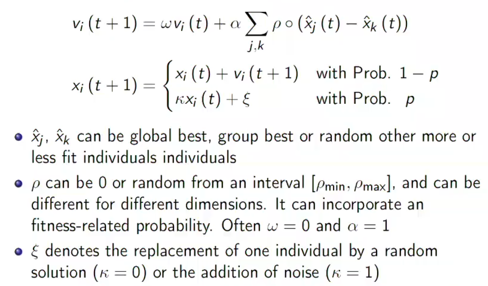

# Other Biologically Inspired Algorithms

These algos are NE, but they are good to roughly know to understand how you could improve the E ones.

## The Bat Algorithm

Inspired by bat flocks, each bat acts like a particle in PSO, however each emits as frequency, wavelength and loudness which change as it finds a solution. This allows the rest of the flock to change between exploration and exploitation dynamically. 

## Artificial Bee Colonies

This algo attempts to replicate the foraging behavior of a honey bee swarm. 

Given a set of current "bests", we mutate each by mixing it with a random solution. 

We then pick the new bests from the mutated set. This allows for solutions that do not improve after mutation to be removed, this is good as these location are likely to be not interesting to exploit. 

## Spider Monkey Algorithm

This algo provides a hierarchical version of ABC; particles have attraction to a local, group and global best.  

## Glow Worm Algorithm

Each worm will calculate the probability of it moving towards each of its neighbours, it then chooses a neighbor and moves to it. They remain seperated to explore multiple locations. 

## The Generic Algorithm

We can represent most continous MHOs using the scheme: 

