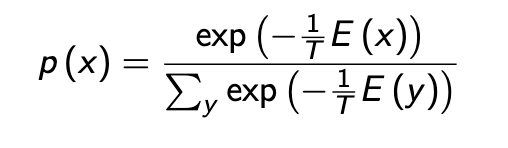

# Evolutionary Algorithms

Evolutionary algorithms take insipration from natural selection by employing:
* Small random mutations
* Selecting good individuals
* Replenishing the population

## Hill Climbing

A hill climbing algorithm aims to find a global minima or maxima by continually making small changes to its subject.

Starting at a random point, the algorithm mutates with set rules; e.g. swap two components, change one component to a random value. Each step it performs this action and is then evaulated by a fitness function `F`.  If `F(x') < F(x)` then the process halts as it has found a minima. 

The issue with this method is it can easily get stuck in minima that are far from the global minima. 


## Simulated Anneling 

Simulated annealing is inspired by real world annealing, a  process of hardening metals by continually heating and cooling them. 

We use this principle to help with the local minima problem of hill climbing. Annealing allows us to escape local minima by assigning a probability to sticking that varies with the value of our fitness  function. 

We use a Boltzmann Distribution to find a probability of sticking with the current minima.



As `p(x)` rises,  the likeihood of escaping from a local minima  decreases until  `p(x) -> 1 ` where we stop. 

The numerator of the above represents our current fitness value. The denominator represents the sum of the fitness of all possible states; as calcualting this value is often intrackable we use the proportionality of `p(x)` to `exp(-1/T * E(x))` carry out this process. 

T represents our temperature, this is how quickly to  increase the probablity of sticking. If  `T`is too large then, we will to quickly settle for a suboptimal minima. If `T` is too small then we will take too long and might as well exhaustive search!

To combat this we can use a Cauchy distribution instead of Boltzmann. 

### Algorithm

```
let Θ = our accepted fitness
let X = all possible solutions
let F = fitness function for F

Set t = 1, F(x_0) = infinity
Choose solution x_t ∈ X
Determine fitness F(x_t)
  if F(x_t) < Θ  then return(x_t)
If t > 0, determine ΔF = F(x_t) - F(x_(t-1))
  If ΔF < 0 then continue
  If ΔF >= 0, then accept local minima with probability exp(-1/T*ΔF)
    otherwise x_t = x_(t-1)
```
### Simulated Annealing Pros and Cons

**Pros**
* Simple, easy to set up
* May be faster than random search
**Cons**
* Usually only one agent so slow
* Not applicable to real world - energy systems may not be at their minimal energy at the lowest fitness. See <a href="https://www.youtube.com/watch?v=xe-f4gokRBs">Prinz Rupert's drops</a>


