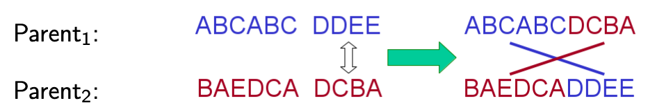

# Genetic Algorithms

Genetic Algorithms takes the evolutionary metaphor a step further by trying to simulate genetic pools and breeding. 

## The Philosohy of GA
A GA uses the following: 

* Encoding: Create a space of solutions
* Fitness: Discriminate good from bad solutions
* Initialization: Start with good solutions
* Selection: Prefer better solutions
* Recombination: Combine parental traits in a novel manner
* Mutation: Creating individual traits by random local search
* Termination: Comparing achieved and achievable fitness

Selection+Mutation = Continual improvment
Selection+Recombination = Innovation

## Problem Solving Using GAs

1. Find a representation of solutions e.g. S = (length of legs, angle limits, motor power)
2. Define an objective/fitness function to be maximised that can be calculated for each S
3. Generate a population of candidates (bag of S)
4. Repeat the following until termination criterion (max iterations or threshold met)
    * Evaluate candidates 
    * Choose high-fitness solutions 
    * Mutate some solutions

## Canonical GAs
### Selection Methods

#### Roulette Wheel Selection

When choosing the top X candidates, we often end up with stagnation in  our gene pool as we tend towards a local optima.

By employing weighted probability to select our candidates we can allow a more diverse gene pool.

#### Rank

Sort by fitness and take the top % or top n solutions

#### Tournement 

Take two solutions at random, keep the one with the highest fitness, repeat until only N remain

### Mutation in GAs

Mutations take place after all the solutions in the pool have been evaluated. There are two main types of mutation that take place.

#### Reproduction & Crossover

Once the poor solutions have been "killed" off, we must repopulate our gene pool. This is done by splicing existing solutions together. For example:

With probability `p`:
* choose a position from 1 to L-1
* cut both individuals after this position
* cross over the individual to yield 2 new genes

#### Mutation

We can randomly change values in our solution to keep our gene pool fresh; as otherwise we would tend towards one solution very quickly. 

Example:
`ABCDE -> ABCAE`

Mutations are usually performed after crossover with very low probability.

Mutation may be rank dependent to help worse solutions gain relevance among the population. 

### Termination 

* A solution is found
* Fitness indicates an improvement over another method
* Fix number of generations
* Allocated computation budget exceeded
* No more diversity in the population
* Fitness has plateaued

### Process

Selection: based on fitness function and selection method
Reproduction: Crossover parents and replace with offspring
Mutation: Take each bit and flip it in turn with a low probability
Termination: repeat until our termination critiea are met

### Pros and Cons
**Pros**
* Small problems often can be solved optimally using this strategy. 

* Large problems however take much longer to reach a near optimal solution due to the amount of variance.

* It can be run quickly as gene pool evaluation and mutation can be parallelized. 

* Adding  new constraints is simple, as only the mutation and fitness functions need updating

**Cons**
* Representing complex problems in a data string can be tough.
* "Good" Fitness solutions are often tough to create
* Many parameters to optimise; population size, fitness cut off, mutation rate etc.
* Valid and useful mutation and crossovers can be difficult to form
