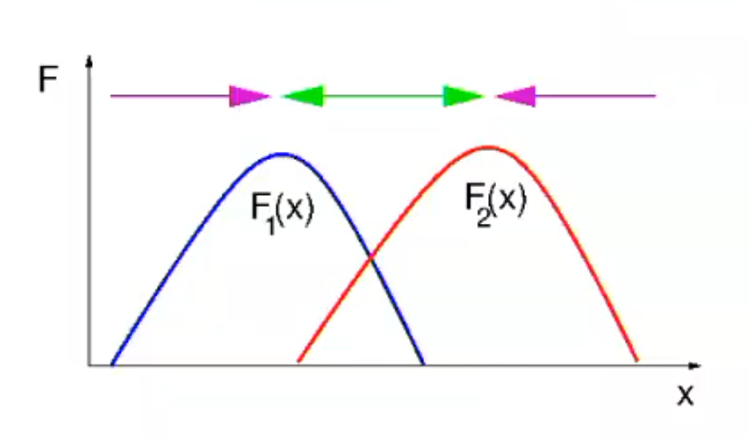
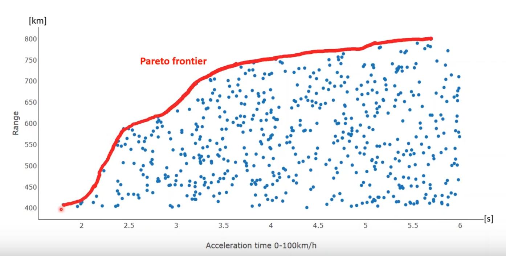
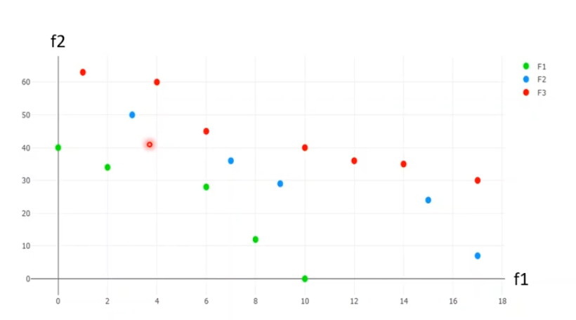

# Unit 14: Multi-objective Optimization and Hybrid Metaheuristics

## Motivation

Optimisation often asks for more than a single global optimum, MOO imples more than one objective function which may conflict. 

## Impact on MHOs

Diversity now means not only a good coverage of the search space but also of diversity across the objective space.

The global optimum is not obvious in MOO, a combination of two functions can still lead of individuals exploiting one while disregarding the other. 

Take the example of two objective functions F_1 and F_2. 

As we improve F_2, we harm F_1. To perform optimally we want to improve one function without losing performance on another. This is called "Pareto Efficincy".

"Pareto Efficincy" is a state in which it is impossible to change the values as to make any criterion better off without making one criterion worse off. 

## GAs for MOO

* It provides a collective search required for sampling the Pareto Set
* GAs allow exploration of non-connected Pareto sets
* Incorporation of constrains in the fitness function
 
Problems
* Defining a fair fitness function can be hard
* Elitism is challenging to define as many individuals will be elite in different functions
* The curse of dimensionality kicks in 

## Pareto Fronts

Often in our search space, we will find a series of pareto solutions, a connected series of these points is known as a _front_.

This example shows the pareto front for a population of cars which are maximising range and acceleration, one the front any small change will cause a decrease in performance at that point. However note that there are better solutions along the pareto front. 

## NSGA-II 

This is a modified GA that allows for optimisation along pareto fronts. The algorithm works as follows:

1. We create offspring and combined population
2. We rank and sort offspring due to performance, then use a non dominated sort to find fronts. 
3. Starting with the highest ranking front, we create a new population, taking the individuals with the highest crowd distance first.

### Non-Dominated Sorting

The goal of non-dominating sorting is to split our popuation into a series of fronts. An individual is dominating another if:
Given `A(x1,y1) B(x2,y2)`; `(x1 <= x2 && y1 <= y2) and (x1 < x2 || y1 < y2)`. Verbally, a individual dominates another the it matches the other in all aspects and is strictly greater than the other in at least one aspect.

We can see that all blue points dominate all green points, and all red points dominate all blue points.

We sort by pairwise checking if one individual dominates another for the whole population. We count how many times an individual is dominated and by which ones. We then can use this information to form fronts.  Details can be found here: [Link to video](https://www.youtube.com/watch?v=SL-u_7hIqjA)

### Crowding Distance Sorting 

We use a crowding distance factor to choose individuals in fronts that are far from others to prevent local minima forming. 

### Producing Offspring

We use tournement selection to create our individuals, this tournment is based on first fitness, then the crowding difference 

## Scalarisation

These approaches turn the MOO into a mono objective function. This can be done through:

* Weighted sum
* Weighted product
* Distance from idea solution

If the pareto front is known, we can find the sitatnce to the true pareto from.

## Memetic Algorithms

Metaphor based on social evolution., includes both genetic and individual learning. The individual search help reduce the likelihood

## Hybridization 

A hybrid metaheursitic is one that combines a metaherustic with other approaches, such as machine learning or constraint programming.

## Hyperheursitic

A hyperheuristic seeks to automate the process of selecting, combining or generating or adapting serveral simplier herustics to solve a search problem. 

