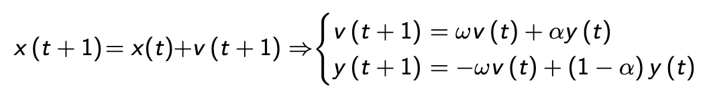
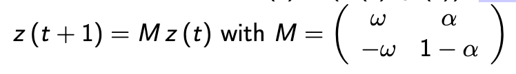
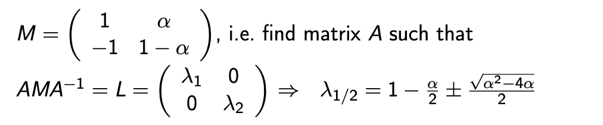
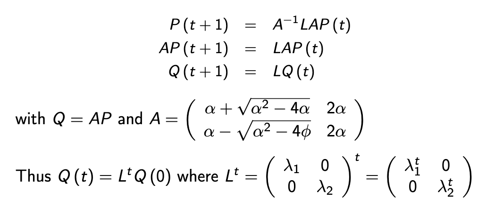
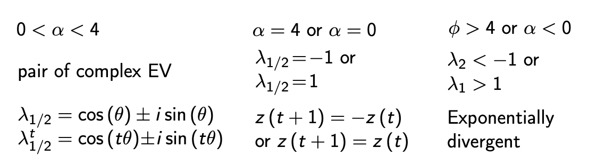
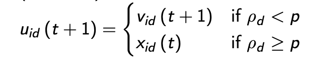
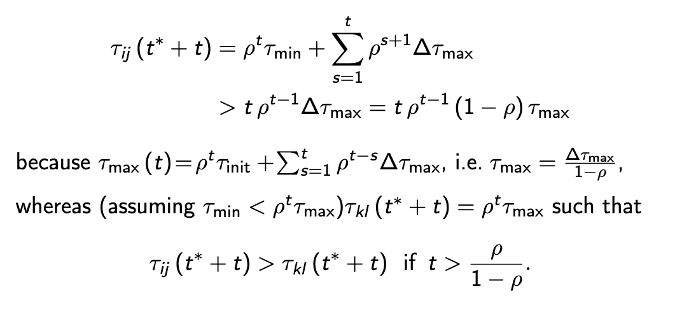

# Parameter Settings

To understand a MHO we need to break the algorithm down to its simplest components.

## PSO

`v_i(t+1) = ωv_i+α1r1◦(p_i−x_i(t)) +α2r2◦(g−x_i(t))`
In PSO, the simplest algorithm involves:
* Ignoring randomness
* Ignoring globa best 
* Keeping the personal best constant

This turns our canoncial PSO into;
`v_id(t+1) =ωv_id(t) +α(p_id−x_id(t))`
where `d = 1..m` are our particles and `i = 1..n`. 
Even simpler; for one particle in one dimension;
`v(t+1) =ωv(t) +α(p−x(t))`
`x(t+1) =x(t) +v(t+1)`

To study the effect of the dynamical properties `ω` and `α`, we use `y(t) = p - x(t)` making:

This means we can describe the state of our particle at timestep `t` through a vector; `z(t) = v(t), y(t))`

Starting from z(0); we can derive the formula `z(t) = M^t⋅z(0)`. 

We can simplify this form even further by setting `ω` to 1 (this means we carry over all the velocity from previous timestep). Once we simplify this; we can calculate the eigenvalues of `M`

The simplified PSO dynamics `P(t) = M^t⋅P(0)` is equivalent to 

We can then split our eigenvalues into 3 cases. 

When `0<α<4`; we have a pair of complex EV, this leads to an oscillatory behavior with period k if `θ=2kπ/t`. 

When `α=0 || α=4`, our eigen values are -1 or 1, this means that there our `z(t+1) = -z(t)`

When `φ >4 or α<0` our EVs are les or greater than -1 and 1 respectivly. 

We want the oscillatory behaviour as this allows us to explore the current best solution more. 

### Constriction Factor In Canonical PSO

If there is a reason to believe the particles are near the global optimum, we can tune our parameters to increase exploitation

We can introduce a constriction factor K 
`vi←K(ωv_i+α1r1◦(p_i−x_i) +α2r2◦(g−x_i))`

We start with an `α > 4` to increase exploitation, and later begin to lower K based on our `α`:

`K = 2/|2-α-sqrt(α^2 - 4φ)|`

This means that for `α = 4.1 => K = 0.729`, meaning `α ~= 1.5` by modification. This will put our particles into an occsilating sttate.

## Differential Evolution

DE is similar to PSO, individual are continuos vectors. Apart  from the initialization there is no direct nosification of the vector.

Diversity is maintained through "mutations" based on the differences in the population (hence differential) such that the algorithm is self-organising. 

We can take the difference between;
* a poor vector to a good one
* or we can influence flow based on vectors of similar fitness

### The Algorithm

Given a population of N vectors of D dimensions;

**Step 1**: `v_i(t+1) =x_q(t) +F·(x_r(t)−x_s(t))`
`q`,`r`,`s` are random indexes, all different and different from i. 

We modify the velocity of x_i by taking a function of a random sample of other particles in the system. 

`F∈[0,2]⊂R` (this provides an amplification of the mutation)

**Step 2**: We choose a random number `ρ_d∈[0,1),d∈{1,...,D}`. For each dimension in each vector we find the value; 
`u_i(t+1) = (u_1i(t+1),u_2i(t+1),...,u_Di(t+1))`

Where `u_id(t+1)` is chosen by; 

**Step 3** We compare our new position `u_i` to the old one, if it is better `x_i(t+1) = u_i(t+1)` else `x_i(t+1) = x_i(t)`

### Parameters

In addition to the amplification factor F, we can modify `N` and `p`, the nubmer of vectors and crossover probability respectivly. Assumin gthere is no selection step we can find that the variance in vectors is expected to change in one generation by:

`<Var>(x_(t+1)) = (2F^2⋅p - 2p/N + p^2/N + 1)Var(x_t)z` _some mega NE maths happens here to make this_

We also find that the variance is constant if;

`F = sqrt(1/N⋅(1 - p/2))`; we therefore can tune F to increase or decrease exploration. 

## ACO Convergence and Hypercube Framework

If we assume that only one global optimum path exisits for a Min-Max Ant System, we can find the probability that a solution is found by time step `t`.

Assume the best path `S*` was found by ant at time `t*`. 

Let `(i,j)`be an edge in `S*` but `τij(t∗) =τmin` and all `(k,I) ∉ S*` have `τkl=τmax`. If only the best ant lays pheromones, then the level on S* will increase withing time steps `t` by: 

We can also find the probability that we will find the global optimum at leasy once by time t to be;

`∀ε > 0 ∃t : P*(t) > 1−ε`

We assume for simplicity that we have a single ant only, the exponent `α=1`, the local desirability is constant, and each step of the solution has at most `K` branches. 

In the worst case, all paths but the optimal one will have `τmax` and the optimal will have `τmin` at `t`. We can then find that:

`p_min=τ_min/(τ_min+ (K−1)τ_max)`

Therefore,w e have `P*(1) > p_min^D > 0`, the probability of finding the optimal at `t=1` is greater than or equal to the mininum probablity raised to the power of the number of components in the solution, as at each step we will have to take an independent chance of choosing the correctt path.

We can then notice that:

`P*(t) >= 1 - (1-p_min^D)^t` as the chance in each run will increase. 

As p_min^D is very small, the conmvergence time very large. We can see that local desirability while reducing complexity, we could also impede our convergence time. 

We can also see that updating the best ant only is important, if we add from all ants, the change of choosing a path may drop.

## Convergence

We can easily show that an MHO will find the global optimum eventually through proof however these often yield exponential functions. 

It is therefore important to find parameter settings that help to speed up the search. 

## Hypercube Framework

The hypercube framework is a used for ACO, we can represent our solutions as a walk along a hypercube where each point is a stop on our tour.

We can then update the links between each stop S during the execution of the algorithm.

From this using big brain math, we can prove that the expected quality of solutions strictly increases with time. 

