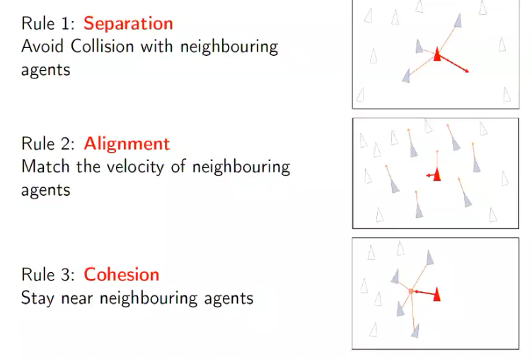

# Unit 4: Particle Swarm Optimization

## Motivation

We use swarms under the hypothesis that there are two major sources of intelligence, namely own experience and communication. A swarm of ants can perform complex tasks. 

## Complex Behavior From Simple Rules

## Particle Swarm Optimization

A particle swarm is a method of finding an optimal solution to an objective function. It uses a _direct search_. It does not know about the entire search space only its local space. 

We define a number of units which collaborate to find a solution. 

### Initializaton

We define an objective function we want to find a solution for. 

We define N particles, a particle has several attributes:
* Positions
* Particle 
* Best value found

We also store the global best value found. 

### The Canonical Algorithm
We create particles 1..N
1. We define a set of N random vector.
2. We update all N particles "velocity" using the global best, the particles best and the random vector defined in (1). We tune the impact of the previous velocity , and random velocity using constants to gain the best performance. Large values emphisise exploration, small emphesize exploitation.  
3. We step each particle according to its velocity to arrive a new space.
4. We find the fitness and update the local bests. 

## Why does it work?

We use two behaviours:

* Exploratory: we can search a large space
* Explotiative: we can use the wisdom of the crowd to quickly find a local minima

## PSO vs GA

* GA and PSO both use a population
* GA is more suited to discrete problems, while PSO works well of continuous
* GA good genes need to beat worse genes, while in PSO the population collaborates
* In GAs fitness is used to select candidates, while PSOs don't use the fitness for selection they only use it to influence their attraction to the solution

## Swarm Topology

While looking at its nearest neighbors is a good comparison to the natural world, there are many different ways to group particles when updating positions.

Some selection methods include 
* Mean
* Clustering 
* <a href="https://en.wikipedia.org/wiki/Small-world_network">Small-worldness </a>

### Restricted Competition

We use a topology to determine who to compare  to and therefore hwo solutions are found across the population.

Global topologys are faster however may converge to local optimum.

Local topologies are slower as the selection takes longer however they don't get trapped as ofen. 

#### Fully Informed Particle Swarm (FIPS)

We distribute our neighbors using weights which are chosen according to quality. All neighbors contribute to the velocity adjustment through a weighted average. 

The best neighbor is **not** selected! We chose the rest to contribute using a probability. 

This method fails often, however can succeed really well if tuned correctly.

## The Algorithm

In order to make this algorithm effective, we must take our knowledge of the problem and set up our particles in  "good" place first, this will help our particles more quickly find a solution.

We then initialize the global and local fitness for each particle to the worst possible. 

As PSO uses a lot of parameters, we may need to tune the weighting and number of particles. 

Each loop we calculate the fitness and update the local, global and all time best fitness values. We then use this new information to update the velocities and positions.

α1, α2: The forces applied at each step
ω: Carry over from the last step

### Convergence

**Failure**: Swarm diverges or stagnates

**Optimally**: Global best approaches global optimum

**Typically** we approach a local optimum due to a premature collapse of the swam

### Controlling the Swarm

* Updating the global best during the stepping loop can help particles take advantage of new solutions to speed up the algorithm.
* Velocity control allows us to clamp the velocity of a particle to prevent it from zooming off in one direction.
* Limited Search Space reflects particles when they hit the boundary, this requires an idea of where the best solution is.

### Exploration

Exploration is a key factor of PSO, particles aren't only attracted to the good solutions but they are pushed past it in its stochastic nature. This can allow us to over come local optima. However exploration can yield poor solutions as we jump around optima rather than land in it. 

### Tuning

We can change the algorithm in many ways:

* Birth, deaths, migration
* Multiobjective optimization
* Norms other than Euclidean
* Population diameter limiting

## Adaptations of PSO

### Separation 

As in Boid's Flocking, we can make sure that our particles are separated by some distance, this allows us to cover more of the search space. This also helps avoid collapse.

Seperation can hamper the late game, as it might stop convergence. 

### Predator-prey

Two types of particles, one is attracted to the global best particle (prey) others are repulsed by the predators. This hope to muddle up the particles to help guide explorations.

### Heterogeneous Swarms (Artificial Chemistry)

This takes inspiration from atoms interacting, using attraction and repulsion

