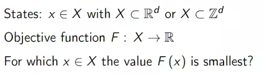

# Problem Solving In Nature

We have many different methods of solving problems:
* Direct Calculation (specific, exact, reliable)
* Analogy, generalization
* Iterative e.g. neural net back prop
* Heuristics & Meta-heuristic
* Trail and error (general, sufficing, sloppy)

> _Definitions_
> 
> Heuristic: Defining value based on knowledge of the problem e.g. you wouldn't use a plumber to fix your shoes
> Meta-heuristic: A more generally applicable value that can be used across many problems. e.g. wing shape across aircraft design

## General problem solving
To be better than guesses, we use evaluation functions for how well our algorithm is performing.  

### Utility

_Utility_ is a general term for a value that is measurable and affected by utility. These values should be transitive; if `a > b,b > c -> a > c`

_Utility theorem_: If a utility value is made up of set of rules, it can be expressed by a function.

_Utility hypothesis_: Every problem can be encoded by a utility function whose maxima are admissible solutions. This hasn't been proven however this is the dream!

We can use this utility function to maximise or minimise our problem to find a good solution. 

#### Example: Evolution of a walking robot
Our utility function should represent all the variables (rules) for the system.  
`Cost = a*weight - b*speed - c*number_of_steps + d*energy_consumped - e*similarity_to_humans`

As our variables and weighting changes, our optimal solution will change. It is up to the user to tune these to get a desirable result.

### Meta-heuristic algorithms

Sometimes finding the optimal solution is intrackable e.g. travelling salesman. We can use a meta-heuristic to iterativly find a _good_ solution.

##  Optimisation 

Optimisation problems can be summarized by these statements:

Given a set of states `X`, that are a subset of all possible states for a problem. We use a function `F` to  find  which set of `X` minimises `F`.

### Hill Climbing

If our problem cannot be expressed by an explict formula, we can use a step-wise optimisation method. These have the disadvantage of getting stuck in local minima meaning we  will not find a global minimum. To combat this, we use some stochastic movement to overcome local mimima. <a href="https://www.youtube.com/watch?v=IHZwWFHWa-w"> For a quick  overview, watch this. Full mathematics aren't required however good to know</a>

We will be looking at problems that lack easily expressible formula meaning that step-wise optimisation like this is not applicable.

