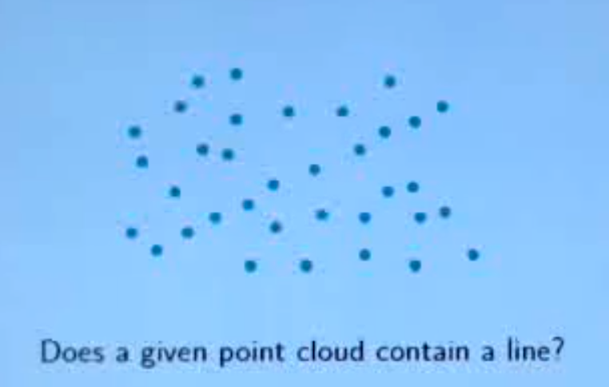
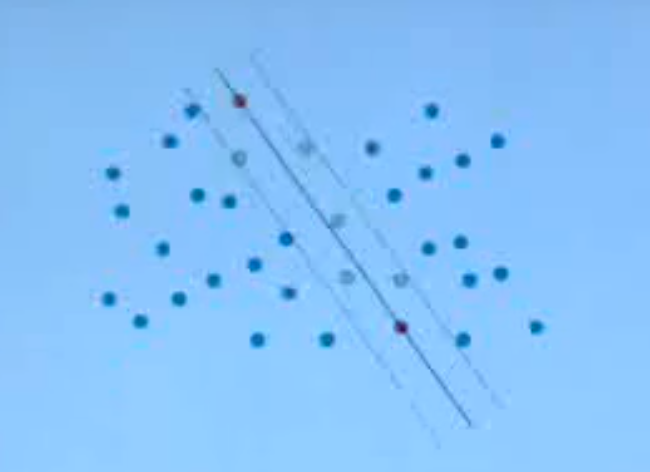
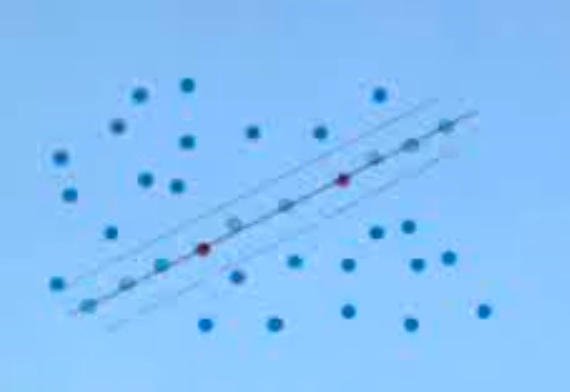

# Examples from other contexts
_NE_ but good to know for comparison
## Hard Satisfiablity Problems (3SAT)
3SAT problem is the issue of deciding wither a logical expression  is satifiable or not. This is very difficult when our number of clauses and symbols are  both large this becomes intractable. 

WalkSAT uses an exhaustive approach to solving this by flipping clauses with probability _p_. We also flip the symbol that leads to the maximal number of correct clauses in a sentance with _1-p_. We continue until we hit a limit of MAX_ITERATIONS. 

WalkSAT uses a hill-climbing algorithm in theory as we work towards a solution by finding maximum solved clauses. We use mutations (flipping with _p_) to aid getting stuck in a poor local minima. 

## RANSAC (Random Sample Consensus)

RANSAC is used in computer vision as to fit a model to a set of points.

It chooses a small subset of points at random. We fit a model and then treat all far points from this model as outliers. We iterate this process many times and choose the best model.
 
For example:

We can choose a subset of these lines and a threshold. We fit a model between these points using linear regression or similar algorithm.

We count the number close to this  line and use this as a our evaluation function.

This is not a good fit as it contains few inliers.

This is a good fit as it contains many inliers.

This is uses a heuristic approach to improve a trail and error approach.

## Random Search is not always bad!

WalkSAT and RANSAC show that random approaches to hard problems can be very effective. However for them to work well we need to employ an evaulation function.

However, we cannot call the outcomes of these algorithms true. RANSAC may produce a false positive. WalkSAT may need to run for longer to find a solution.