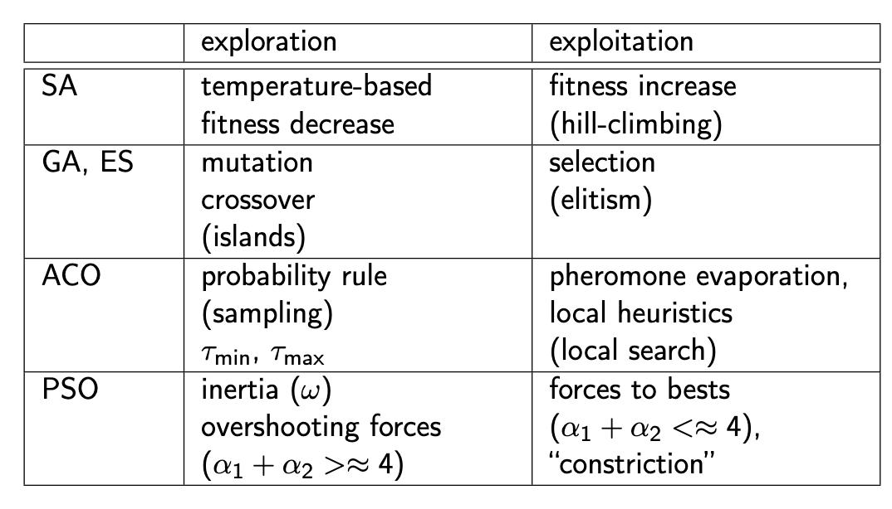
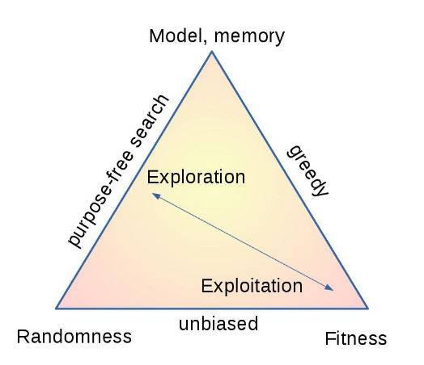
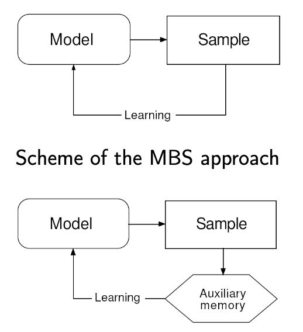
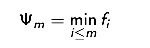
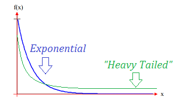

# Unit 8: Theroetical Aspects of Metaheursitic Algorithms

## General Scheme

The general aspects of MHOs are:

1. Embrace Randomness
2. Use populations of solutions
3. Maintain diversity
4. Select or favour the best individuals
5. Transfer information in the propulation from the best individuals to others
6. Design fitness function such that it can use building blocks 
7. Avoid local minima
8. Store good solutions in memory
9. Tweak the parameters
10. Develop your own variants
11. User domain knowledge for problem representation
12. Check what the algorithm is doing

## Why do we need theory in MHO

* We need to be able to reason about why some algorithms perform better than random search

* We need a way of measuring the success of an algorithm

* We need a way to effectivly communicate the algorithms 

When developing an MHO we look for systems that have a trade off between two factors:
* Exploration vs exploitation
* Cooperation vs competition
* Diversification vs intensification
* Global search vs local descent
* Randomness vs greediness

## Intensification and Diversification

All MHO algorithms are characterized by a specific bias due to;

* memory of solutions
* interaction among the solutions 
* dependencies in the noise

## A General Framework

As MHOs are so diverse, it is challenging to obtain a single model that represnets all MHOs well. Proposals for frameworks include:

* Model-based search
* Biased random walk
* Bayesian inference
* Dynamical systems

### Model Based Search

Model based solutions are made using a probabilistic model. Our model produces a set of samples, which we analyse and learn from. Using these learnings, we modify the model.  

ACO's model is the graph, its sample is the running the ants through and we learn by updating the pheromones.

A GA is a bit more complex, we have a memory in the form of a population, we don't learn from the whole sample, we modify our memory and learn from that. 

A PSO is more obvious, our global and local bests are stored and used to define our next model. 

Models can only capture part of an algorithm, in order to capture more complex behavior our model has to develop in complexity as well. 

## Optimization as Search

A search function in essence decides where to look next for a better solution. 

**MATHS WARNING**

Given a search space `X` and an objective function `f: X -> R`

We can find a set `d_m = {(x_1,f_1),...,(x_m,f_m)}`. We want to find the optimal `x` in `X`

An optimization algorithm `A(d_m) = x_(m+1)` gives the sample the algorithm decides where to look next.

This allows us to then extend `f_(m+1) = f(x_(m+1))` and `d_m -> d_(m+1)`

In GA, we only use `d_m` to create `d_(m+1)`

In PSO, we use the just the best and local best. 

IN ACO we use a mixture of current and previous.

### Performance of an optimization

We can measure the performance of a fitness function without directly referring to the algorithm; 

The sequence of fitnesses returned by a search depends on `A`, for a given fitness function we need to talk about `Ψ_m(f,A)` where `A∈(set of all algorithms)`.

### No-Free Lunch Theorem

A free lunch is an algorithm that is better than any other algorithm for "all the problems".  

If we try and find a "free lunch" we quickly run into a fundamental results in optimisation, the "No Free Lunch Theorem", which shows that all non-resampling optimization algorithms perform equally over averaged over all problems. 

This has interesting consequences; it states that random search is no better in locating the global optimum on average than a MHO.

This means that MHOs are generally really good at a small subset of problems, but it is impossible to find an objectivity _better_ function.

Free lunches can exist in the runtime and resampling domains, e.g. if one algorithm needs one execution of the fitness function, and the other needs one hundred, the first is better _only_ in the runtime domain. 

## Random Walks

A random walk is an undirected local search. We randomly move around a space and update a local and global fitness with each step. 

As dimensions get higher, it get hard to cover a large amount of space as we can walk in so many different directions 

Random walks are used in many MHO algorithms to introduce diversity. An unbiased random walk can be used to find the fitness landscape.

We can use random walk as a baseline comparison for MHO algorithms. 

### Lévy Flight

A random walk in which the step lengths have probability distribution that is heavy-tailed. Heavy-tailed means that the probability drop off as x increases is greater than the exponent.

### Informed Search

A biased random walk where we bias our walk on a heuristic. This allows for best-first search methods. 

### Bayesian Frameworks

We can bias the search based on prior information, for example pheromones in ACO. We can uses Baye's to bias our random walk to express a belieft about a global optimum. 

## Dynamical Systems

We can also use dynamic behaviours to perform a walk; for example a cellular automata can be used to simulate dynamic systems.

