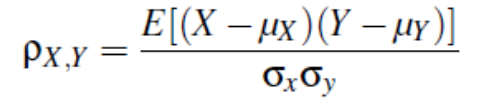
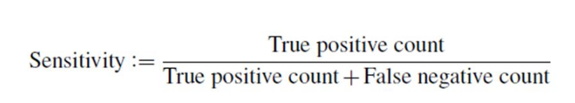
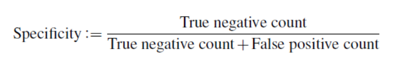
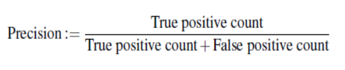
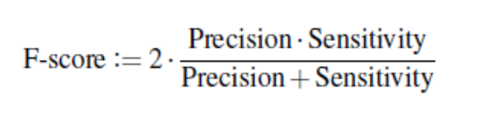

# Analysis with IMUs

## Dimensionality

IMU sensor systems often have many data sources. For example:

* 7 IMU devices
* Sensors per device: 3
* Axes per sensor: 3

Leads to 7*3*3 = 63 dimensions! This is hard to analyse.

## Using Data

### Model-based segmentation

Model based segmentation aims to have a series of states, which can be used analysed. These are composed of:

* Joint Angles: calculated using fusion of accelerometer and gyroscope data from individual devices attached to the connected limbs.

* Joint Positions: computed by combining joint angles, lengths of limbs and applying forward kinematics. 

* Frames: A collection of joint angles and positions. 

From these values we can dervie the overall motion in 3 axes. In biomechanics these are know as: 

* Traverse: X axis
* Saggital: Y axis
* Coronal: Z axis

Using these measurements we can simulate what the body was doing at each timestep, allowing use to either model the figure or apply analysis methods to get a deeper insight into overall trends. 

However, this technique is sensitive to sensory noise as the attached sensors aren't being move purely by the skeletal frame; muscle "jiggle" can create noise. These values also drift slowly overtime, meaning that a filter needs applying. 

### Model-free   segmentation

This a collection of techniques that use a low-dimensional representation of high-dimensional datasets. 

#### Dimensionialty Reduction Techniques

##### Dynamic Time Warping

This technique finds the optimal match between two given sequences. Datapoints are warped small amounts until  a good match is found. 

This method works well for matching two datapoints that may be offset by time, e.g. one timer has a longer transfer time. However it runs in `O(n^d)` meaning  it slow!

##### PCA

PCA finds the dimension of the data that explains the largest amount of variance and projects data points onto that scale. It's good for sensor data like this as it can summerize all the dimensions into one, making thresholding and visualisation easier. 

## Analysis & Verficiation Techniques

### Pearson's Product-Moment Coefficeient (Cross-corollation)
This is a measure of the linear correlation between two sets of data. Positive Coefficient implies a positive corrolation, negative coefficient implies negative, if the coefficient is ~0 then there is no corrolation. 

### ANOVA

ANOVA tests tests various group means in a sample to evaluate how relevant it is to the larger population. It assigns a grouping an  F score, which shows its relevance to the populous. 

### Recall

### Specificity 

### Precision 

### F-Score 

