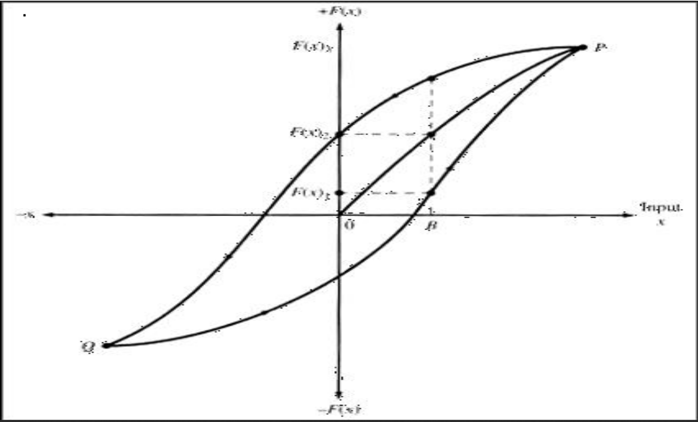
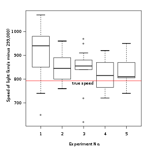

# Calibrating Sensors

## Types of Error
Systematic
Random

## Why do we to calibrate sensors?

* Variation do to defects from manufacturing
* Differences in design, sensors using the same method to measure the same thing may respond differently under similar conditions
* After being exposed to extreme conditions, the IC could be damaged
* Slipping values due to age
* Converting analog to digital

## Characteristics of Sensors

### Range
Maximum and minimum values that a sensor operates effectivly at

### Accuracy

Given a ground truth, the level of uncertainty in a sensors measurement

Uncertainty is given in an abosolute ± value in a unit the same as the sensor outputs. e.g. ±0.01mA.

Gain errors (the error generated when converting from a discrete to a continuous value) are often expressed as a percentage of the magitude of the input signal. 

### Precision

Reeproducibility of the measurements

### Resolution

The smallest unit of change, independent of its enviroment. 

A 16 bit sensor, would have a Resolution of 1 part in 2^16. If this on a voltmeter (±10V) for example; the resolution would be 20/2^16 = 305μV per (analog-to-digital conversion) ADC count.

If a portion of these bits are noise, we can use an average to remove it.
We include square root of the number of counts of noise. For example:

If a system has 2^3 counts of noise, averaging 64 samples will reduce noise contribution to 1 count. `√64 = 8: 8÷8 = 1`

### Sensitivity

The smallest change that in _enviroment_ can be measured

Given a sensor with ±1.0 volt input range and ±4 counts of noise; we find our ADC resolution is 2^12.

The peak-to-peak sensitivity is `±4 counts * (2÷2^12)` or ±1.9mV.

### Hysteresis

The measure of how the sensor changes independent of the direction of the changes of the input parameter. 

### Linearity

The proportionality of value to the input. This can be affected by the temperature, vibration, noise level or humidity.

#### Dynamic Non-linearity

When the sensor outputs a non linear function, we must measure how well our approximation of the function fits the value. For example a exponential is not well represented bt a line. 

### Response Time

The Response Time (Tr) is the time taken by the sensor output to change to a settled value given a change of input.

## Calibrating

We aim to map the sensors response to an ideal response by: 
* Offseting
* Adjusting Slop
* Adjusting Lineareity

### Calibration Methods

We need methods to see how effective our calibration process is

#### Standard Deviation

We use SD when the data is normally distributed around a mean. A simple test using SD is to check our values lie within 2 SDs of the mean. 

#### Box and Whisker Plot

We use this to inspect the interquartile ranges of our data. 

#### Confidence Interval

Using a CI gives the range that is likely to contain the true population value.

#### Correlation

We can use correlation metrics to see how well aligned our data is to the 

#### Bland and Altman 

Measures the agreement of a dataset
We plot the difference between measurements and the mean in a population. We measure how close the points are to the (difference = 0) line to find the systemic error.

We can use this to find the difference between true change and noise if a data point lies outside the SD of the plot. 
<a href="https://www.youtube.com/watch?v=bEp_ygrTDes">Watch this</a>

#### Odds Ratio

Odds Ratio can show a relationship between two different variables. For example a mutated gene to cancer (<a href="https://www.youtube.com/watch?v=8nm0G-1uJzA">see this </a>).

#### Risk Ratio

This uses the probability of an event occurring in a similar way to the odds ratio.

It measures the relative risk betweeen two varialbes.